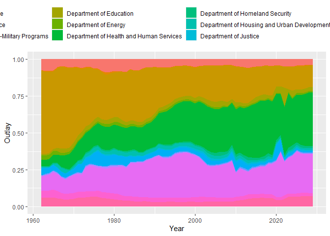

united_states_budget
================
Benjamin Panny
2024-04-13

Let’s look at [Table 4.1—Outlays by Agency:
1962–2029](https://www.whitehouse.gov/omb/budget/historical-tables/)

``` r
library(httr)
library(readxl)
library(tidyverse)

# URL of the Excel file
url <- "https://www.whitehouse.gov/wp-content/uploads/2024/03/hist04z1_fy2025.xlsx"

# Download file into memory
response <- GET(url)

# Create a temporary file
temp_file <- tempfile(fileext = ".xlsx")

# Write the content of the response to the temporary file
writeBin(content(response, "raw"), temp_file)

# Read the Excel file from the temporary file
file <- read_excel(temp_file)

# (Optional) Clean up by deleting the temporary file after use
unlink(temp_file)

file %>% head
```

    ## # A tibble: 6 × 70
    ##   Table 4.1 - OUTLAYS BY…¹ ...2  ...3  ...4  ...5  ...6  ...7  ...8  ...9  ...10
    ##   <chr>                    <chr> <chr> <chr> <chr> <chr> <chr> <chr> <chr> <chr>
    ## 1 (in millions of dollars) <NA>  <NA>  <NA>  <NA>  <NA>  <NA>  <NA>  <NA>  <NA> 
    ## 2 Department or other unit 1962  1963  1964  1965  1966  1967  1968  1969  1970 
    ## 3 Legislative Branch       196.0 192.0 199.0 212.0 234.0 252.0 269.0 289.0 353.0
    ## 4 Judicial Branch          57.0  62.0  66.0  75.0  80.0  88.0  94.0  110.0 133.0
    ## 5 Department of Agricultu… 6437… 7414… 7569… 6940… 5633… 5952… 7430… 8446… 8412…
    ## 6 Department of Commerce   215.0 354.0 702.0 736.0 485.0 477.0 582.0 607.0 778.0
    ## # ℹ abbreviated name: ¹​`Table 4.1 - OUTLAYS BY AGENCY:  1962 - 2029`
    ## # ℹ 60 more variables: ...11 <chr>, ...12 <chr>, ...13 <chr>, ...14 <chr>,
    ## #   ...15 <chr>, ...16 <chr>, ...17 <chr>, ...18 <chr>, ...19 <chr>,
    ## #   ...20 <chr>, ...21 <chr>, ...22 <chr>, ...23 <chr>, ...24 <chr>,
    ## #   ...25 <chr>, ...26 <chr>, ...27 <chr>, ...28 <chr>, ...29 <chr>,
    ## #   ...30 <chr>, ...31 <chr>, ...32 <chr>, ...33 <chr>, ...34 <chr>,
    ## #   ...35 <chr>, ...36 <chr>, ...37 <chr>, ...38 <chr>, ...39 <chr>, …

``` r
library(tidyverse)
file[1,] %>% t() %>% unique
```

    ##                                             [,1]                      
    ## Table 4.1 - OUTLAYS BY AGENCY:  1962 - 2029 "(in millions of dollars)"
    ## ...2                                        NA

Row 1 only mentions that values are given in millions of dollars, so it
can be dropped. Also, “Department or Other Unit” is the true column
label for the rest of what is in column 1, while the rest of row 2 is
the year. I eventually want to plot by year and by department. So let’s
transform the dataframe to have a column for Department, a column for
Year, and a column for Outlay

``` r
data <- file[-1,] %>% 
  rename(tmp_colname = `Table 4.1 - OUTLAYS BY AGENCY:  1962 - 2029`) %>% 
  mutate(tmp_colname = ifelse(tmp_colname == "Department or other unit", "Year", tmp_colname)) %>% 
  t() %>% 
  as_tibble()
```

    ## Warning: The `x` argument of `as_tibble.matrix()` must have unique column names if
    ## `.name_repair` is omitted as of tibble 2.0.0.
    ## ℹ Using compatibility `.name_repair`.
    ## This warning is displayed once every 8 hours.
    ## Call `lifecycle::last_lifecycle_warnings()` to see where this warning was
    ## generated.

``` r
clean_colnames <- unlist(data[1,])
data <- data[-1,]
colnames(data) <- clean_colnames
dep_of_interest <- clean_colnames[1:34]

data_long <- data %>% 
  pivot_longer(cols = -Year,
               names_to = "Department or Other Unit",
               values_to = "Outlay") %>% 
  # TQ stands for "Transition Quarter" and dirties my Year column type!
  filter(Year != "TQ") %>% 
  mutate(across(everything(), ~na_if(.,"..........")),
         Year = str_replace(Year, " estimate", "") %>% as.integer(),
         Outlay = as.numeric(Outlay)) %>% 
  replace_na(list("Outlay" = 0)) %>% 
  # I don't want to deal with negative outlays, so I'm removing them
  mutate(Outlay = ifelse(Outlay < 0, NA, Outlay)) %>% 
  filter(!is.na(Outlay), `Department or Other Unit` %in% dep_of_interest)

data_long %>% 
  filter(str_detect(`Department or Other Unit`, 'Department')) %>% 
  ggplot(aes(x = Year, y = Outlay, fill = `Department or Other Unit`)) +
  geom_area(stat = "identity", position = "fill") +
  # for totals instead of proportions
  # geom_area()
  theme(legend.position = "top")
```

<!-- -->

``` r
library(dplyr)
library(ggplot2)
library(plotly)
```

    ## Warning: package 'plotly' was built under R version 4.3.2

    ## 
    ## Attaching package: 'plotly'

    ## The following object is masked from 'package:ggplot2':
    ## 
    ##     last_plot

    ## The following object is masked from 'package:httr':
    ## 
    ##     config

    ## The following object is masked from 'package:stats':
    ## 
    ##     filter

    ## The following object is masked from 'package:graphics':
    ## 
    ##     layout

``` r
library(stringr)

# Assuming data_long is already loaded and prepared
data_long %>%
  filter(str_detect(`Department or Other Unit`, 'Department')) %>%
  ggplot(aes(x = Year, y = Outlay, fill = `Department or Other Unit`, text = `Department or Other Unit`)) +
  geom_area() +
  theme(legend.position = "none") -> p

# Convert ggplot to plotly for interactivity
interactive_plot <- ggplotly(p, tooltip = "text")

# Display the plot
interactive_plot
```

    ## PhantomJS not found. You can install it with webshot::install_phantomjs(). If it is installed, please make sure the phantomjs executable can be found via the PATH variable.

<div class="plotly html-widget html-fill-item-overflow-hidden html-fill-item" id="htmlwidget-47641e953069ec4bf3d2" style="width:672px;height:480px;"></div>
<script type="application/json" data-for="htmlwidget-47641e953069ec4bf3d2">{"x":{"data":[{"x":[1961.933,1962,1962.067,1962.933,1963,1963.067,1963.933,1964,1964.067,1964.933,1965,1965.067,1965.933,1966,1966.067,1966.933,1967,1967.067,1967.933,1968,1968.067,1968.933,1969,1969.067,1969.933,1970,1970.067,1970.933,1971,1971.067,1971.933,1972,1972.067,1972.933,1973,1973.067,1973.933,1974,1974.067,1974.933,1975,1975.067,1975.933,1976,1976.067,1976.933,1977,1977.067,1977.933,1978,1978.067,1978.933,1979,1979.067,1979.933,1980,1980.067,1980.933,1981,1981.067,1981.933,1982,1982.067,1982.933,1983,1983.067,1983.933,1984,1984.067,1984.933,1985,1985.067,1985.933,1986,1986.067,1986.933,1987,1987.067,1987.933,1988,1988.067,1988.933,1989,1989.067,1989.933,1990,1990.067,1990.933,1991,1991.067,1991.933,1992,1992.067,1992.933,1993,1993.067,1993.933,1994,1994.067,1994.933,1995,1995.067,1995.933,1996,1996.067,1996.933,1997,1997.067,1997.933,1998,1998.067,1998.933,1999,1999.067,1999.933,2000,2000.067,2000.933,2001,2001.067,2001.933,2002,2002.067,2002.933,2003,2003.067,2003.933,2004,2004.067,2004.933,2005,2005.067,2005.933,2006,2006.067,2006.933,2007,2007.067,2007.933,2008,2008.067,2008.933,2009,2009.067,2009.933,2010,2010.067,2010.933,2011,2011.067,2011.933,2012,2012.067,2012.933,2013,2013.067,2013.933,2014,2014.067,2014.933,2015,2015.067,2015.933,2016,2016.067,2016.933,2017,2017.067,2017.933,2018,2018.067,2018.933,2019,2019.067,2019.933,2020,2020.067,2020.933,2021,2021.067,2021.933,2022,2022.067,2022.933,2023,2023.067,2023.933,2024,2024.067,2024.933,2025,2025.067,2025.933,2026,2026.067,2026.933,2027,2027.067,2027.933,2028,2028.067,2028.933,2029,2029.067,2029.067,2029,2028.933,2028.067,2028,2027.933,2027.067,2027,2026.933,2026.067,2026,2025.933,2025.067,2025,2024.933,2024.067,2024,2023.933,2023.067,2023,2022.933,2022.067,2022,2021.933,2021.067,2021,2020.933,2020.067,2020,2019.933,2019.067,2019,2018.933,2018.067,2018,2017.933,2017.067,2017,2016.933,2016.067,2016,2015.933,2015.067,2015,2014.933,2014.067,2014,2013.933,2013.067,2013,2012.933,2012.067,2012,2011.933,2011.067,2011,2010.933,2010.067,2010,2009.933,2009.067,2009,2008.933,2008.067,2008,2007.933,2007.067,2007,2006.933,2006.067,2006,2005.933,2005.067,2005,2004.933,2004.067,2004,2003.933,2003.067,2003,2002.933,2002.067,2002,2001.933,2001.067,2001,2000.933,2000.067,2000,1999.933,1999.067,1999,1998.933,1998.067,1998,1997.933,1997.067,1997,1996.933,1996.067,1996,1995.933,1995.067,1995,1994.933,1994.067,1994,1993.933,1993.067,1993,1992.933,1992.067,1992,1991.933,1991.067,1991,1990.933,1990.067,1990,1989.933,1989.067,1989,1988.933,1988.067,1988,1987.933,1987.067,1987,1986.933,1986.067,1986,1985.933,1985.067,1985,1984.933,1984.067,1984,1983.933,1983.067,1983,1982.933,1982.067,1982,1981.933,1981.067,1981,1980.933,1980.067,1980,1979.933,1979.067,1979,1978.933,1978.067,1978,1977.933,1977.067,1977,1976.933,1976.067,1976,1975.933,1975.067,1975,1974.933,1974.067,1974,1973.933,1973.067,1973,1972.933,1972.067,1972,1971.933,1971.067,1971,1970.933,1970.067,1970,1969.933,1969.067,1969,1968.933,1968.067,1968,1967.933,1967.067,1967,1966.933,1966.067,1966,1965.933,1965.067,1965,1964.933,1964.067,1964,1963.933,1963.067,1963,1962.933,1962.067,1962,1961.933,1961.933],"y":[0,81967,82147.933500000028,84486.566499999972,84667.5,84893.591500000024,87815.908499999976,88042,87882.405999999988,85819.594000000012,85660,86532.474000000104,97809.525999999896,98682,100109.97100000015,118567.02899999985,119995,121219.89400000013,137052.10599999988,138277,138465.80600000001,140906.19399999999,141095,141686.61000000007,149333.38999999993,149925,150486.66100000005,157746.33899999995,158308,159085.40100000007,169133.59899999993,169911,170492.09100000007,178002.90899999993,178584,179501.16300000012,191355.83699999988,192273,194886.13400000028,228661.86599999972,231275,232992.0760000002,255185.9239999998,256903,258058.68300000011,272996.31699999986,274152,276090.04200000019,301139.95799999981,303078,305385.94900000026,335217.05099999974,337525,341428.55400000041,391883.44599999959,395787,400102.80500000046,455886.19499999954,460202,463425.83900000033,505095.16099999967,508319,511364.08300000033,550722.91699999967,553768,556553.86000000034,592562.13999999966,595348,600414.9420000005,665907.05799999938,670974,673233.97700000019,702445.02299999981,704705,705781.7570000001,719699.2429999999,720776,723984.22800000035,765451.77199999965,768660,772766.8320000004,825849.1679999996,829956,833476.44800000044,878979.55199999956,882500,884767.14600000018,914070.85399999982,916338,923123.49200000078,1010828.5079999992,1017614,1019679.9450000002,1046383.0549999998,1048449,1049681.5320000001,1065612.4679999999,1066845,1071051.9300000004,1125428.0699999996,1129635,1130942.9070000001,1147848.0929999999,1149156,1152150.9670000004,1190862.0329999996,1193857,1195622.1150000002,1218436.8849999998,1220202,1222076.3920000002,1246303.6079999998,1248178,1252054.8210000005,1302164.1789999995,1306041,1310838.8700000006,1372853.1299999994,1377651,1385789.4230000009,1490981.5769999991,1499120,1507889.4290000009,1621237.5709999991,1630007,1637119.3850000007,1729049.6149999993,1736162,1744805.6030000008,1856527.3969999992,1865171,1876047.7130000012,2016633.2869999988,2027510,2032260.7690000006,2093666.2309999994,2098417,2111329.1060000015,2278222.8939999985,2291135,2318721.6470000031,2675289.3529999969,2702876,2698198.7299999995,2637743.2700000005,2633066,2639034.2930000005,2716176.7069999995,2722145,2709640.9239999987,2548021.0760000013,2535517,2529261.4779999992,2448406.5220000008,2442151,2444897.3970000003,2480395.6029999997,2483142,2492562.736000001,2614329.263999999,2623750,2631766.617000001,2735384.382999999,2743401,2750665.7430000007,2844565.2569999993,2851830,2857961.9070000006,2937219.0929999994,2943351,2959224.1040000017,3164389.8959999983,3180263,3275970.4230000102,4513024.5769999893,4608732,4640696.4940000037,5053849.5059999963,5085814,5069437.1899999985,4857760.8100000015,4841384,4839840.2194999997,4819886.2805000003,4818342.5,4833423.4295000015,5028350.0704999985,5043431,5063665.7370000025,5325207.2629999975,5345442,5351075.4940000009,5423890.5059999991,5429524,5443857.7120000012,5629126.2879999988,5643460,5665610.2670000028,5951910.7329999972,5974061,5980019.7120000003,6057038.2879999997,6062997,0,0,6302479,6296459.0499999989,6218648.9500000011,6212629,6190398.7349999975,5903064.2650000025,5880834,5866442.1319999984,5680421.8680000016,5666030,5660178.2869999995,5584542.7130000005,5578691,5559898.9739999976,5317005.0260000024,5298213,5281396.8374999985,5064041.6625000015,5047225.5,5049863.1895000003,5083956.3104999997,5086594,5102299.6040000012,5305300.3959999988,5321006,5285626.4489999963,4828332.5510000037,4792953,4694961.1449999893,3428379.8550000107,3330388,3313616.4929999979,3096838.5070000021,3080067,3073321.6409999994,2986135.3590000006,2979390,2972835.6579999994,2888118.3420000006,2881564,2873611.166999999,2770817.833000001,2762865,2753624.6949999989,2634190.3050000011,2624950,2623147.432,2599848.568,2598046,2603217.5960000004,2670062.4039999996,2675234,2687716.6360000013,2849059.3639999987,2861542,2854907.8609999991,2769159.1390000009,2762525,2766195.9970000004,2813645.0029999996,2817316,2788145.1379999965,2411100.8620000035,2381930,2368591.2379999985,2196182.7620000015,2182844,2178703.3329999996,2125183.6670000004,2121043,2109615.2119999989,1961906.7880000011,1950479,1940914.280999999,1817286.719000001,1807722,1800688.4739999992,1709777.5260000008,1702744,1693698.865999999,1576787.134000001,1567742,1559566.659999999,1453897.340000001,1445722,1441393.1299999994,1385440.8700000006,1381112,1376405.6519999995,1315574.3480000005,1310868,1308397.9779999997,1276472.0220000003,1274002,1272142.6159999997,1248109.3840000003,1246250,1243377.3079999997,1206246.6920000003,1203374,1202222.3369999998,1187336.6630000002,1186185,1182250.4249999996,1131394.5750000004,1127460,1126388.5359999998,1112539.4640000002,1111468,1108953.2219999998,1076448.7780000002,1073934,1066992.3979999993,977269.60200000077,970328,967516.00999999966,931169.99000000034,928358,924998.21799999964,881571.78200000036,878212,873815.32599999954,816986.67400000046,812590,809755.43099999975,773117.56900000025,770283,769815.40700000001,763771.59299999999,763304,760832.0349999998,728880.9650000002,726409,720437.08899999934,643247.91100000066,637276,635186.20299999975,608174.79700000025,606085,602591.41899999965,557435.58100000035,553942,550444.66699999967,505240.33300000039,501743,496970.25499999948,435280.74500000052,430508,426401.90499999956,373329.09500000044,369223,366813.27799999976,335666.72200000024,333257,330857.19399999973,299838.80600000027,297439,295907.78199999983,276116.21800000017,274585,272722.93599999981,248655.06400000022,246793,243830.39399999968,205537.60600000032,202575,201648.7919999999,189677.2080000001,188751,188227.12699999995,181455.87300000005,180932,179997.28299999991,167915.71700000009,166981,166401.85199999996,158916.14800000004,158337,157747.66799999992,150130.33200000008,149541,149284.12199999997,145963.87800000003,145707,144383.07999999987,127270.92000000014,125947,124497.65599999984,105764.34400000016,104315,103530.09499999991,93384.905000000086,92600,92801.737000000023,95409.262999999977,95611,95374.523499999967,92317.976500000033,92081.5,91835.107499999969,88650.392500000031,88404,0,0],"text":"Department of Agriculture","type":"scatter","mode":"lines","line":{"width":1.8897637795275593,"color":"transparent","dash":"solid"},"fill":"toself","fillcolor":"rgba(248,118,109,1)","hoveron":"points","name":"Department of Agriculture","legendgroup":"Department of Agriculture","showlegend":true,"xaxis":"x","yaxis":"y","hoverinfo":"text","frame":null},{"x":[1961.933,1962,1962.067,1962.933,1963,1963.067,1963.933,1964,1964.067,1964.933,1965,1965.067,1965.933,1966,1966.067,1966.933,1967,1967.067,1967.933,1968,1968.067,1968.933,1969,1969.067,1969.933,1970,1970.067,1970.933,1971,1971.067,1971.933,1972,1972.067,1972.933,1973,1973.067,1973.933,1974,1974.067,1974.933,1975,1975.067,1975.933,1976,1976.067,1976.933,1977,1977.067,1977.933,1978,1978.067,1978.933,1979,1979.067,1979.933,1980,1980.067,1980.933,1981,1981.067,1981.933,1982,1982.067,1982.933,1983,1983.067,1983.933,1984,1984.067,1984.933,1985,1985.067,1985.933,1986,1986.067,1986.933,1987,1987.067,1987.933,1988,1988.067,1988.933,1989,1989.067,1989.933,1990,1990.067,1990.933,1991,1991.067,1991.933,1992,1992.067,1992.933,1993,1993.067,1993.933,1994,1994.067,1994.933,1995,1995.067,1995.933,1996,1996.067,1996.933,1997,1997.067,1997.933,1998,1998.067,1998.933,1999,1999.067,1999.933,2000,2000.067,2000.933,2001,2001.067,2001.933,2002,2002.067,2002.933,2003,2003.067,2003.933,2004,2004.067,2004.933,2005,2005.067,2005.933,2006,2006.067,2006.933,2007,2007.067,2007.933,2008,2008.067,2008.933,2009,2009.067,2009.933,2010,2010.067,2010.933,2011,2011.067,2011.933,2012,2012.067,2012.933,2013,2013.067,2013.933,2014,2014.067,2014.933,2015,2015.067,2015.933,2016,2016.067,2016.933,2017,2017.067,2017.933,2018,2018.067,2018.933,2019,2019.067,2019.933,2020,2020.067,2020.933,2021,2021.067,2021.933,2022,2022.067,2022.933,2023,2023.067,2023.933,2024,2024.067,2024.933,2025,2025.067,2025.933,2026,2026.067,2026.933,2027,2027.067,2027.933,2028,2028.067,2028.933,2029,2029.067,2029.067,2029,2028.933,2028.067,2028,2027.933,2027.067,2027,2026.933,2026.067,2026,2025.933,2025.067,2025,2024.933,2024.067,2024,2023.933,2023.067,2023,2022.933,2022.067,2022,2021.933,2021.067,2021,2020.933,2020.067,2020,2019.933,2019.067,2019,2018.933,2018.067,2018,2017.933,2017.067,2017,2016.933,2016.067,2016,2015.933,2015.067,2015,2014.933,2014.067,2014,2013.933,2013.067,2013,2012.933,2012.067,2012,2011.933,2011.067,2011,2010.933,2010.067,2010,2009.933,2009.067,2009,2008.933,2008.067,2008,2007.933,2007.067,2007,2006.933,2006.067,2006,2005.933,2005.067,2005,2004.933,2004.067,2004,2003.933,2003.067,2003,2002.933,2002.067,2002,2001.933,2001.067,2001,2000.933,2000.067,2000,1999.933,1999.067,1999,1998.933,1998.067,1998,1997.933,1997.067,1997,1996.933,1996.067,1996,1995.933,1995.067,1995,1994.933,1994.067,1994,1993.933,1993.067,1993,1992.933,1992.067,1992,1991.933,1991.067,1991,1990.933,1990.067,1990,1989.933,1989.067,1989,1988.933,1988.067,1988,1987.933,1987.067,1987,1986.933,1986.067,1986,1985.933,1985.067,1985,1984.933,1984.067,1984,1983.933,1983.067,1983,1982.933,1982.067,1982,1981.933,1981.067,1981,1980.933,1980.067,1980,1979.933,1979.067,1979,1978.933,1978.067,1978,1977.933,1977.067,1977,1976.933,1976.067,1976,1975.933,1975.067,1975,1974.933,1974.067,1974,1973.933,1973.067,1973,1972.933,1972.067,1972,1971.933,1971.067,1971,1970.933,1970.067,1970,1969.933,1969.067,1969,1968.933,1968.067,1968,1967.933,1967.067,1967,1966.933,1966.067,1966,1965.933,1965.067,1965,1964.933,1964.067,1964,1963.933,1963.067,1963,1962.933,1962.067,1962,1961.933,1961.933],"y":[0,81752,81923.620500000019,84141.879499999981,84313.5,84516.275500000018,87137.224499999982,87340,87178.127999999982,85085.872000000018,84924,85813.291000000099,97307.708999999901,98197,99625.507000000158,118089.49299999984,119518,120735.85900000013,136477.14099999989,137695,137882.13100000002,140300.86899999998,140488,141068.15300000008,148566.84699999992,149147,149708.32600000006,156963.67399999994,157525,158297.91200000007,168288.08799999993,169061,169636.46300000008,177074.53699999992,177650,178563.27700000012,190367.72299999988,191281,193888.43900000027,227590.5609999997,230198,231887.8070000002,253729.1929999998,255419,256539.44100000011,271021.55899999989,272142,273898.47200000018,296601.52799999982,298358,300745.14300000027,331599.85699999973,333987,337917.9570000004,388727.0429999996,392658,397029.61600000045,453534.38399999955,457906,461146.05300000036,503024.94699999964,506265,509318.72600000032,548789.27399999963,551843,554630.93700000027,590666.06299999973,593454,598504.52700000058,663784.47299999942,668835,671098.72900000028,700358.27099999972,702622,703695.80900000012,717575.19099999988,718649,721847.11100000038,763183.88899999962,766382,770469.26800000039,823298.73199999961,827386,830828.46000000043,875323.53999999957,878766,881110.12900000019,911408.87099999981,913753,920539.76500000071,1008261.2349999993,1015048,1017098.4680000002,1043601.5319999998,1045652,1046876.6260000002,1062705.3739999998,1063930,1068104.3680000005,1122059.6319999995,1126234,1127521.7400000002,1144166.2599999998,1145454,1148443.6070000003,1187085.3929999997,1190075,1191823.0970000003,1214417.9029999997,1216166,1217974.4640000002,1241349.5359999998,1243158,1246849.3650000005,1294561.6349999995,1298253,1303237.4650000005,1367663.5349999995,1372648,1380765.7200000009,1485690.2799999991,1493808,1502553.7780000009,1615596.2219999991,1624342,1631443.3970000008,1723231.6029999992,1730333,1738955.297000001,1850401.702999999,1859024,1869885.6380000012,2010276.3619999988,2021138,2025881.8680000005,2087198.1319999995,2091942,2104770.6240000012,2270585.3759999988,2283414,2310799.848000003,2664772.151999997,2692158,2687312.0239999997,2624675.9760000003,2619830,2626019.7950000009,2706025.2049999991,2712215,2699688.3449999988,2537776.6550000012,2525250,2519069.9869999993,2439191.0130000007,2433011,2435840.8120000004,2472417.1879999996,2475247,2484596.6490000011,2605444.3509999989,2614794,2622796.614000001,2726233.385999999,2734236,2741424.0280000009,2834331.9719999991,2841520,2847768.8220000006,2928537.1779999994,2934786,2950474.3180000018,3153251.6819999982,3168940,3264339.6920000105,4497416.3079999899,4592816,4624966.8210000033,5040528.1789999967,5072679,5056396.123999998,4845933.876000002,4829651,4828086.1814999999,4807860.3185000001,4806295.5,4820809.4755000016,5008408.0244999984,5022922,5042275.8880000021,5292432.1119999979,5311786,5316757.4670000002,5381015.5329999998,5385987,5400326.7420000015,5585673.2579999985,5600013,5623551.0380000025,5927788.9619999975,5951327,5957405.8430000003,6035977.1569999997,6042056,0,0,6062997,6057038.2879999997,5980019.7120000003,5974061,5951910.7329999972,5665610.2670000028,5643460,5629126.2879999988,5443857.7120000012,5429524,5423890.5059999991,5351075.4940000009,5345442,5325207.2629999975,5063665.7370000025,5043431,5028350.0704999985,4833423.4295000015,4818342.5,4819886.2805000003,4839840.2194999997,4841384,4857760.8100000015,5069437.1899999985,5085814,5053849.5059999963,4640696.4940000037,4608732,4513024.5769999893,3275970.4230000102,3180263,3164389.8959999983,2959224.1040000017,2943351,2937219.0929999994,2857961.9070000006,2851830,2844565.2569999993,2750665.7430000007,2743401,2735384.382999999,2631766.617000001,2623750,2614329.263999999,2492562.736000001,2483142,2480395.6029999997,2444897.3970000003,2442151,2448406.5220000008,2529261.4779999992,2535517,2548021.0760000013,2709640.9239999987,2722145,2716176.7069999995,2639034.2930000005,2633066,2637743.2700000005,2698198.7299999995,2702876,2675289.3529999969,2318721.6470000031,2291135,2278222.8939999985,2111329.1060000015,2098417,2093666.2309999994,2032260.7690000006,2027510,2016633.2869999988,1876047.7130000012,1865171,1856527.3969999992,1744805.6030000008,1736162,1729049.6149999993,1637119.3850000007,1630007,1621237.5709999991,1507889.4290000009,1499120,1490981.5769999991,1385789.4230000009,1377651,1372853.1299999994,1310838.8700000006,1306041,1302164.1789999995,1252054.8210000005,1248178,1246303.6079999998,1222076.3920000002,1220202,1218436.8849999998,1195622.1150000002,1193857,1190862.0329999996,1152150.9670000004,1149156,1147848.0929999999,1130942.9070000001,1129635,1125428.0699999996,1071051.9300000004,1066845,1065612.4679999999,1049681.5320000001,1048449,1046383.0549999998,1019679.9450000002,1017614,1010828.5079999992,923123.49200000078,916338,914070.85399999982,884767.14600000018,882500,878979.55199999956,833476.44800000044,829956,825849.1679999996,772766.8320000004,768660,765451.77199999965,723984.22800000035,720776,719699.2429999999,705781.7570000001,704705,702445.02299999981,673233.97700000019,670974,665907.05799999938,600414.9420000005,595348,592562.13999999966,556553.86000000034,553768,550722.91699999967,511364.08300000033,508319,505095.16099999967,463425.83900000033,460202,455886.19499999954,400102.80500000046,395787,391883.44599999959,341428.55400000041,337525,335217.05099999974,305385.94900000026,303078,301139.95799999981,276090.04200000019,274152,272996.31699999986,258058.68300000011,256903,255185.9239999998,232992.0760000002,231275,228661.86599999972,194886.13400000028,192273,191355.83699999988,179501.16300000012,178584,178002.90899999993,170492.09100000007,169911,169133.59899999993,159085.40100000007,158308,157746.33899999995,150486.66100000005,149925,149333.38999999993,141686.61000000007,141095,140906.19399999999,138465.80600000001,138277,137052.10599999988,121219.89400000013,119995,118567.02899999985,100109.97100000015,98682,97809.525999999896,86532.474000000104,85660,85819.594000000012,87882.405999999988,88042,87815.908499999976,84893.591500000024,84667.5,84486.566499999972,82147.933500000028,81967,0,0],"text":"Department of Commerce","type":"scatter","mode":"lines","line":{"width":1.8897637795275593,"color":"transparent","dash":"solid"},"fill":"toself","fillcolor":"rgba(229,135,0,1)","hoveron":"points","name":"Department of Commerce","legendgroup":"Department of Commerce","showlegend":true,"xaxis":"x","yaxis":"y","hoverinfo":"text","frame":null},{"x":[1961.933,1962,1962.067,1962.933,1963,1963.067,1963.933,1964,1964.067,1964.933,1965,1965.067,1965.933,1966,1966.067,1966.933,1967,1967.067,1967.933,1968,1968.067,1968.933,1969,1969.067,1969.933,1970,1970.067,1970.933,1971,1971.067,1971.933,1972,1972.067,1972.933,1973,1973.067,1973.933,1974,1974.067,1974.933,1975,1975.067,1975.933,1976,1976.067,1976.933,1977,1977.067,1977.933,1978,1978.067,1978.933,1979,1979.067,1979.933,1980,1980.067,1980.933,1981,1981.067,1981.933,1982,1982.067,1982.933,1983,1983.067,1983.933,1984,1984.067,1984.933,1985,1985.067,1985.933,1986,1986.067,1986.933,1987,1987.067,1987.933,1988,1988.067,1988.933,1989,1989.067,1989.933,1990,1990.067,1990.933,1991,1991.067,1991.933,1992,1992.067,1992.933,1993,1993.067,1993.933,1994,1994.067,1994.933,1995,1995.067,1995.933,1996,1996.067,1996.933,1997,1997.067,1997.933,1998,1998.067,1998.933,1999,1999.067,1999.933,2000,2000.067,2000.933,2001,2001.067,2001.933,2002,2002.067,2002.933,2003,2003.067,2003.933,2004,2004.067,2004.933,2005,2005.067,2005.933,2006,2006.067,2006.933,2007,2007.067,2007.933,2008,2008.067,2008.933,2009,2009.067,2009.933,2010,2010.067,2010.933,2011,2011.067,2011.933,2012,2012.067,2012.933,2013,2013.067,2013.933,2014,2014.067,2014.933,2015,2015.067,2015.933,2016,2016.067,2016.933,2017,2017.067,2017.933,2018,2018.067,2018.933,2019,2019.067,2019.933,2020,2020.067,2020.933,2021,2021.067,2021.933,2022,2022.067,2022.933,2023,2023.067,2023.933,2024,2024.067,2024.933,2025,2025.067,2025.933,2026,2026.067,2026.933,2027,2027.067,2027.933,2028,2028.067,2028.933,2029,2029.067,2029.067,2029,2028.933,2028.067,2028,2027.933,2027.067,2027,2026.933,2026.067,2026,2025.933,2025.067,2025,2024.933,2024.067,2024,2023.933,2023.067,2023,2022.933,2022.067,2022,2021.933,2021.067,2021,2020.933,2020.067,2020,2019.933,2019.067,2019,2018.933,2018.067,2018,2017.933,2017.067,2017,2016.933,2016.067,2016,2015.933,2015.067,2015,2014.933,2014.067,2014,2013.933,2013.067,2013,2012.933,2012.067,2012,2011.933,2011.067,2011,2010.933,2010.067,2010,2009.933,2009.067,2009,2008.933,2008.067,2008,2007.933,2007.067,2007,2006.933,2006.067,2006,2005.933,2005.067,2005,2004.933,2004.067,2004,2003.933,2003.067,2003,2002.933,2002.067,2002,2001.933,2001.067,2001,2000.933,2000.067,2000,1999.933,1999.067,1999,1998.933,1998.067,1998,1997.933,1997.067,1997,1996.933,1996.067,1996,1995.933,1995.067,1995,1994.933,1994.067,1994,1993.933,1993.067,1993,1992.933,1992.067,1992,1991.933,1991.067,1991,1990.933,1990.067,1990,1989.933,1989.067,1989,1988.933,1988.067,1988,1987.933,1987.067,1987,1986.933,1986.067,1986,1985.933,1985.067,1985,1984.933,1984.067,1984,1983.933,1983.067,1983,1982.933,1982.067,1982,1981.933,1981.067,1981,1980.933,1980.067,1980,1979.933,1979.067,1979,1978.933,1978.067,1978,1977.933,1977.067,1977,1976.933,1976.067,1976,1975.933,1975.067,1975,1974.933,1974.067,1974,1973.933,1973.067,1973,1972.933,1972.067,1972,1971.933,1971.067,1971,1970.933,1970.067,1970,1969.933,1969.067,1969,1968.933,1968.067,1968,1967.933,1967.067,1967,1966.933,1966.067,1966,1965.933,1965.067,1965,1964.933,1964.067,1964,1963.933,1963.067,1963,1962.933,1962.067,1962,1961.933,1961.933],"y":[0,31641,31743.208500000012,33064.291499999985,33166.5,33272.929500000013,34648.570499999987,34755,34848.063000000009,36050.936999999991,36144,36507.408000000039,41204.591999999961,41568,42096.02700000006,48920.97299999994,49449,49977.697000000058,56811.302999999942,57340,57499.25900000002,59557.74099999998,59717,60340.569000000069,68400.430999999939,69024,69761.268000000084,79290.731999999916,80028,80790.996000000086,90653.003999999914,91416,92166.467000000077,101866.53299999992,102617,103340.60000000008,112693.39999999992,113417,115556.24300000024,143206.75699999975,145346,146830.45200000016,166017.54799999984,167502,168138.03100000008,176358.96899999992,176995,178274.96800000014,194819.03199999986,196099,197725.96100000018,218755.03899999982,220382,223153.3880000003,258974.6119999997,261746,264580.03300000029,301210.96699999971,304045,305487.30900000018,324129.69099999982,325572,327040.30500000017,346018.69499999983,347487,349168.96800000017,370909.03199999983,372591,376017.04500000039,420299.95499999961,423726,424627.55200000008,436280.44799999992,437182,437687.71600000007,444224.28399999993,444730,447394.12100000028,481828.87899999972,484493,487713.28800000035,529336.71199999971,532557,536343.50500000047,585285.49499999953,589072,593281.00700000045,647683.99299999955,651893,657023.92700000061,723343.07299999939,728474,731064.75600000028,764551.24399999972,767142,769032.13700000022,793462.86299999978,795353,800136.39800000051,861963.60199999949,866747,868456.2370000002,890548.7629999998,892258,894908.18500000029,929162.81499999971,931813,933726.52000000025,958459.47999999975,960373,961819.46300000022,980515.53699999978,981962,984324.62100000028,1014862.3789999997,1017225,1021595.9460000005,1078092.0539999995,1082463,1087789.5000000007,1156636.4999999993,1161963,1166900.4310000006,1230718.5689999994,1235656,1239518.0810000005,1289436.9189999995,1293299,1299420.8570000005,1378548.1429999995,1384670,1393857.3080000009,1512606.6919999991,1521794,1524579.1900000004,1560578.8099999996,1563364,1571764.996000001,1680351.003999999,1688752,1713316.2770000028,2030818.7229999972,2055383,2048531.0439999993,1959966.9560000007,1953115,1958543.7420000006,2028712.2579999994,2034141,2023437.2139999988,1885086.786000001,1874383,1871088.4759999996,1828505.5240000004,1825211,1830044.2460000005,1892515.7539999995,1897349,1907730.3820000011,2041913.6179999989,2052295,2060105.2570000009,2161055.7429999993,2168866,2175817.719000001,2265671.280999999,2272623,2276734.0530000003,2329870.9469999997,2333982,2346126.5540000014,2503099.4459999986,2515244,2608187.0030000103,3809509.9969999897,3902453,3932780.4160000035,4324773.5839999961,4355101,4338223.5659999987,4120076.4340000018,4103199,4098322.9074999993,4035297.5925000007,4030421.5,4040312.341500001,4168155.158499999,4178046,4195606.6330000022,4422584.3669999978,4440145,4444501.8090000004,4500815.1909999996,4505172,4518562.9550000019,4691646.0449999981,4705037,4727299.6930000028,5015053.3069999972,5037316,5042009.5510000009,5102675.4489999991,5107369,0,0,6042056,6035977.1569999997,5957405.8430000003,5951327,5927788.9619999975,5623551.0380000025,5600013,5585673.2579999985,5400326.7420000015,5385987,5381015.5329999998,5316757.4670000002,5311786,5292432.1119999979,5042275.8880000021,5022922,5008408.0244999984,4820809.4755000016,4806295.5,4807860.3185000001,4828086.1814999999,4829651,4845933.876000002,5056396.123999998,5072679,5040528.1789999967,4624966.8210000033,4592816,4497416.3079999899,3264339.6920000105,3168940,3153251.6819999982,2950474.3180000018,2934786,2928537.1779999994,2847768.8220000006,2841520,2834331.9719999991,2741424.0280000009,2734236,2726233.385999999,2622796.614000001,2614794,2605444.3509999989,2484596.6490000011,2475247,2472417.1879999996,2435840.8120000004,2433011,2439191.0130000007,2519069.9869999993,2525250,2537776.6550000012,2699688.3449999988,2712215,2706025.2049999991,2626019.7950000009,2619830,2624675.9760000003,2687312.0239999997,2692158,2664772.151999997,2310799.848000003,2283414,2270585.3759999988,2104770.6240000012,2091942,2087198.1319999995,2025881.8680000005,2021138,2010276.3619999988,1869885.6380000012,1859024,1850401.702999999,1738955.297000001,1730333,1723231.6029999992,1631443.3970000008,1624342,1615596.2219999991,1502553.7780000009,1493808,1485690.2799999991,1380765.7200000009,1372648,1367663.5349999995,1303237.4650000005,1298253,1294561.6349999995,1246849.3650000005,1243158,1241349.5359999998,1217974.4640000002,1216166,1214417.9029999997,1191823.0970000003,1190075,1187085.3929999997,1148443.6070000003,1145454,1144166.2599999998,1127521.7400000002,1126234,1122059.6319999995,1068104.3680000005,1063930,1062705.3739999998,1046876.6260000002,1045652,1043601.5319999998,1017098.4680000002,1015048,1008261.2349999993,920539.76500000071,913753,911408.87099999981,881110.12900000019,878766,875323.53999999957,830828.46000000043,827386,823298.73199999961,770469.26800000039,766382,763183.88899999962,721847.11100000038,718649,717575.19099999988,703695.80900000012,702622,700358.27099999972,671098.72900000028,668835,663784.47299999942,598504.52700000058,593454,590666.06299999973,554630.93700000027,551843,548789.27399999963,509318.72600000032,506265,503024.94699999964,461146.05300000036,457906,453534.38399999955,397029.61600000045,392658,388727.0429999996,337917.9570000004,333987,331599.85699999973,300745.14300000027,298358,296601.52799999982,273898.47200000018,272142,271021.55899999989,256539.44100000011,255419,253729.1929999998,231887.8070000002,230198,227590.5609999997,193888.43900000027,191281,190367.72299999988,178563.27700000012,177650,177074.53699999992,169636.46300000008,169061,168288.08799999993,158297.91200000007,157525,156963.67399999994,149708.32600000006,149147,148566.84699999992,141068.15300000008,140488,140300.86899999998,137882.13100000002,137695,136477.14099999989,120735.85900000013,119518,118089.49299999984,99625.507000000158,98197,97307.708999999901,85813.291000000099,84924,85085.872000000018,87178.127999999982,87340,87137.224499999982,84516.275500000018,84313.5,84141.879499999981,81923.620500000019,81752,0,0],"text":"Department of Defense--Military Programs","type":"scatter","mode":"lines","line":{"width":1.8897637795275593,"color":"transparent","dash":"solid"},"fill":"toself","fillcolor":"rgba(201,152,0,1)","hoveron":"points","name":"Department of Defense--Military Programs","legendgroup":"Department of Defense--Military Programs","showlegend":true,"xaxis":"x","yaxis":"y","hoverinfo":"text","frame":null},{"x":[1961.933,1962,1962.067,1962.933,1963,1963.067,1963.933,1964,1964.067,1964.933,1965,1965.067,1965.933,1966,1966.067,1966.933,1967,1967.067,1967.933,1968,1968.067,1968.933,1969,1969.067,1969.933,1970,1970.067,1970.933,1971,1971.067,1971.933,1972,1972.067,1972.933,1973,1973.067,1973.933,1974,1974.067,1974.933,1975,1975.067,1975.933,1976,1976.067,1976.933,1977,1977.067,1977.933,1978,1978.067,1978.933,1979,1979.067,1979.933,1980,1980.067,1980.933,1981,1981.067,1981.933,1982,1982.067,1982.933,1983,1983.067,1983.933,1984,1984.067,1984.933,1985,1985.067,1985.933,1986,1986.067,1986.933,1987,1987.067,1987.933,1988,1988.067,1988.933,1989,1989.067,1989.933,1990,1990.067,1990.933,1991,1991.067,1991.933,1992,1992.067,1992.933,1993,1993.067,1993.933,1994,1994.067,1994.933,1995,1995.067,1995.933,1996,1996.067,1996.933,1997,1997.067,1997.933,1998,1998.067,1998.933,1999,1999.067,1999.933,2000,2000.067,2000.933,2001,2001.067,2001.933,2002,2002.067,2002.933,2003,2003.067,2003.933,2004,2004.067,2004.933,2005,2005.067,2005.933,2006,2006.067,2006.933,2007,2007.067,2007.933,2008,2008.067,2008.933,2009,2009.067,2009.933,2010,2010.067,2010.933,2011,2011.067,2011.933,2012,2012.067,2012.933,2013,2013.067,2013.933,2014,2014.067,2014.933,2015,2015.067,2015.933,2016,2016.067,2016.933,2017,2017.067,2017.933,2018,2018.067,2018.933,2019,2019.067,2019.933,2020,2020.067,2020.933,2021,2021.067,2021.933,2022,2022.067,2022.933,2023,2023.067,2023.933,2024,2024.067,2024.933,2025,2025.067,2025.933,2026,2026.067,2026.933,2027,2027.067,2027.933,2028,2028.067,2028.933,2029,2029.067,2029.067,2029,2028.933,2028.067,2028,2027.933,2027.067,2027,2026.933,2026.067,2026,2025.933,2025.067,2025,2024.933,2024.067,2024,2023.933,2023.067,2023,2022.933,2022.067,2022,2021.933,2021.067,2021,2020.933,2020.067,2020,2019.933,2019.067,2019,2018.933,2018.067,2018,2017.933,2017.067,2017,2016.933,2016.067,2016,2015.933,2015.067,2015,2014.933,2014.067,2014,2013.933,2013.067,2013,2012.933,2012.067,2012,2011.933,2011.067,2011,2010.933,2010.067,2010,2009.933,2009.067,2009,2008.933,2008.067,2008,2007.933,2007.067,2007,2006.933,2006.067,2006,2005.933,2005.067,2005,2004.933,2004.067,2004,2003.933,2003.067,2003,2002.933,2002.067,2002,2001.933,2001.067,2001,2000.933,2000.067,2000,1999.933,1999.067,1999,1998.933,1998.067,1998,1997.933,1997.067,1997,1996.933,1996.067,1996,1995.933,1995.067,1995,1994.933,1994.067,1994,1993.933,1993.067,1993,1992.933,1992.067,1992,1991.933,1991.067,1991,1990.933,1990.067,1990,1989.933,1989.067,1989,1988.933,1988.067,1988,1987.933,1987.067,1987,1986.933,1986.067,1986,1985.933,1985.067,1985,1984.933,1984.067,1984,1983.933,1983.067,1983,1982.933,1982.067,1982,1981.933,1981.067,1981,1980.933,1980.067,1980,1979.933,1979.067,1979,1978.933,1978.067,1978,1977.933,1977.067,1977,1976.933,1976.067,1976,1975.933,1975.067,1975,1974.933,1974.067,1974,1973.933,1973.067,1973,1972.933,1972.067,1972,1971.933,1971.067,1971,1970.933,1970.067,1970,1969.933,1969.067,1969,1968.933,1968.067,1968,1967.933,1967.067,1967,1966.933,1966.067,1966,1965.933,1965.067,1965,1964.933,1964.067,1964,1963.933,1963.067,1963,1962.933,1962.067,1962,1961.933,1961.933],"y":[0,30825,30915.885500000011,32090.614499999989,32181.5,32288.733500000013,33674.766499999991,33782,33863.070000000007,34910.929999999993,34992,35270.72000000003,38873.27999999997,39152,39600.967000000048,45404.032999999952,45853,46349.805000000051,52771.194999999949,53268,53432.753000000019,55562.246999999981,55727,56310.101000000061,63846.898999999939,64430,65133.433000000077,74225.566999999923,74929,75662.650000000081,85145.349999999919,85879,86617.943000000087,96169.056999999913,96908,97629.054000000076,106948.94599999992,107670,109703.11500000022,135981.88499999978,138015,139461.53000000017,158158.46999999983,159605,160186.09100000007,167696.90899999993,168278,169483.53100000013,185065.46899999987,186271,187741.24800000017,206744.75199999983,208215,210822.57300000029,244526.42699999973,247134,249809.84600000028,284396.15399999969,287072,288666.13100000017,309270.86899999983,310865,312351.66300000018,331567.33699999982,333054,334669.57100000017,355551.42899999983,357167,360514.52100000036,403782.47899999964,407130,407965.82500000007,418769.17499999993,419605,420171.48500000004,427493.51499999996,428060,430625.29600000026,463782.70399999974,466348,469345.64700000029,508091.35299999971,511089,514774.73700000043,562414.26299999957,566100,570159.99900000042,622637.00099999958,626697,631785.31500000053,697553.68499999947,702642,704946.19700000028,734728.80299999972,737033,739295.12100000028,768533.87899999972,770796,775133.98200000054,831204.01799999946,835542,837350.26300000027,860722.73699999973,862531,865162.29100000032,899172.70899999968,901804,903631.42500000016,927251.57499999984,929079,930526.06600000022,949229.93399999978,950677,952892.82400000026,981533.17599999974,983749,987982.79700000049,1042706.2029999995,1046940,1051539.5500000005,1110990.4499999995,1115590,1119805.7070000004,1174295.2929999996,1178511,1181995.5360000003,1227034.4639999997,1230519,1235965.6310000005,1306365.3689999995,1311812,1319625.1380000007,1420612.8619999993,1428426,1433019.9220000005,1492398.0779999995,1496992,1505420.3990000009,1614360.6009999991,1622789,1648195.7350000029,1976587.2649999971,2001994,1992438.325999999,1868927.674000001,1859372,1866694.0950000009,1961334.9049999993,1968657,1958504.9589999989,1827286.0410000011,1817134,1814934.1889999998,1786500.8110000002,1784301,1787881.3460000004,1834158.6539999996,1837739,1846082.3090000011,1953922.6909999989,1962266,1970950.674000001,2083203.325999999,2091888,2096513.2110000006,2156295.7889999994,2160921,2168247.5840000007,2262946.4159999993,2270273,2279693.5350000011,2401457.4649999989,2410878,2497117.6530000092,3611797.3469999908,3698037,3724610.2050000029,4068078.7949999971,4094652,4052387.1939999955,3506098.8060000045,3463834,3471977.046000001,3577228.953999999,3585372,3608281.9800000023,3904402.0199999977,3927312,3952167.1240000026,4273428.8759999974,4298284,4302833.1660000002,4361632.8339999998,4366182,4378715.0200000014,4540708.9799999986,4553242,4574489.2410000023,4849117.7589999977,4870365,4874619.9020000007,4929616.0979999993,4933871,0,0,5107369,5102675.4489999991,5042009.5510000009,5037316,5015053.3069999972,4727299.6930000028,4705037,4691646.0449999981,4518562.9550000019,4505172,4500815.1909999996,4444501.8090000004,4440145,4422584.3669999978,4195606.6330000022,4178046,4168155.158499999,4040312.341500001,4030421.5,4035297.5925000007,4098322.9074999993,4103199,4120076.4340000018,4338223.5659999987,4355101,4324773.5839999961,3932780.4160000035,3902453,3809509.9969999897,2608187.0030000103,2515244,2503099.4459999986,2346126.5540000014,2333982,2329870.9469999997,2276734.0530000003,2272623,2265671.280999999,2175817.719000001,2168866,2161055.7429999993,2060105.2570000009,2052295,2041913.6179999989,1907730.3820000011,1897349,1892515.7539999995,1830044.2460000005,1825211,1828505.5240000004,1871088.4759999996,1874383,1885086.786000001,2023437.2139999988,2034141,2028712.2579999994,1958543.7420000006,1953115,1959966.9560000007,2048531.0439999993,2055383,2030818.7229999972,1713316.2770000028,1688752,1680351.003999999,1571764.996000001,1563364,1560578.8099999996,1524579.1900000004,1521794,1512606.6919999991,1393857.3080000009,1384670,1378548.1429999995,1299420.8570000005,1293299,1289436.9189999995,1239518.0810000005,1235656,1230718.5689999994,1166900.4310000006,1161963,1156636.4999999993,1087789.5000000007,1082463,1078092.0539999995,1021595.9460000005,1017225,1014862.3789999997,984324.62100000028,981962,980515.53699999978,961819.46300000022,960373,958459.47999999975,933726.52000000025,931813,929162.81499999971,894908.18500000029,892258,890548.7629999998,868456.2370000002,866747,861963.60199999949,800136.39800000051,795353,793462.86299999978,769032.13700000022,767142,764551.24399999972,731064.75600000028,728474,723343.07299999939,657023.92700000061,651893,647683.99299999955,593281.00700000045,589072,585285.49499999953,536343.50500000047,532557,529336.71199999971,487713.28800000035,484493,481828.87899999972,447394.12100000028,444730,444224.28399999993,437687.71600000007,437182,436280.44799999992,424627.55200000008,423726,420299.95499999961,376017.04500000039,372591,370909.03199999983,349168.96800000017,347487,346018.69499999983,327040.30500000017,325572,324129.69099999982,305487.30900000018,304045,301210.96699999971,264580.03300000029,261746,258974.6119999997,223153.3880000003,220382,218755.03899999982,197725.96100000018,196099,194819.03199999986,178274.96800000014,176995,176358.96899999992,168138.03100000008,167502,166017.54799999984,146830.45200000016,145346,143206.75699999975,115556.24300000024,113417,112693.39999999992,103340.60000000008,102617,101866.53299999992,92166.467000000077,91416,90653.003999999914,80790.996000000086,80028,79290.731999999916,69761.268000000084,69024,68400.430999999939,60340.569000000069,59717,59557.74099999998,57499.25900000002,57340,56811.302999999942,49977.697000000058,49449,48920.97299999994,42096.02700000006,41568,41204.591999999961,36507.408000000039,36144,36050.936999999991,34848.063000000009,34755,34648.570499999987,33272.929500000013,33166.5,33064.291499999985,31743.208500000012,31641,0,0],"text":"Department of Education","type":"scatter","mode":"lines","line":{"width":1.8897637795275593,"color":"transparent","dash":"solid"},"fill":"toself","fillcolor":"rgba(163,165,0,1)","hoveron":"points","name":"Department of Education","legendgroup":"Department of Education","showlegend":true,"xaxis":"x","yaxis":"y","hoverinfo":"text","frame":null},{"x":[1961.933,1962,1962.067,1962.933,1963,1963.067,1963.933,1964,1964.067,1964.933,1965,1965.067,1965.933,1966,1966.067,1966.933,1967,1967.067,1967.933,1968,1968.067,1968.933,1969,1969.067,1969.933,1970,1970.067,1970.933,1971,1971.067,1971.933,1972,1972.067,1972.933,1973,1973.067,1973.933,1974,1974.067,1974.933,1975,1975.067,1975.933,1976,1976.067,1976.933,1977,1977.067,1977.933,1978,1978.067,1978.933,1979,1979.067,1979.933,1980,1980.067,1980.933,1981,1981.067,1981.933,1982,1982.067,1982.933,1983,1983.067,1983.933,1984,1984.067,1984.933,1985,1985.067,1985.933,1986,1986.067,1986.933,1987,1987.067,1987.933,1988,1988.067,1988.933,1989,1989.067,1989.933,1990,1990.067,1990.933,1991,1991.067,1991.933,1992,1992.067,1992.933,1993,1993.067,1993.933,1994,1994.067,1994.933,1995,1995.067,1995.933,1996,1996.067,1996.933,1997,1997.067,1997.933,1998,1998.067,1998.933,1999,1999.067,1999.933,2000,2000.067,2000.933,2001,2001.067,2001.933,2002,2002.067,2002.933,2003,2003.067,2003.933,2004,2004.067,2004.933,2005,2005.067,2005.933,2006,2006.067,2006.933,2007,2007.067,2007.933,2008,2008.067,2008.933,2009,2009.067,2009.933,2010,2010.067,2010.933,2011,2011.067,2011.933,2012,2012.067,2012.933,2013,2013.067,2013.933,2014,2014.067,2014.933,2015,2015.067,2015.933,2016,2016.067,2016.933,2017,2017.067,2017.933,2018,2018.067,2018.933,2019,2019.067,2019.933,2020,2020.067,2020.933,2021,2021.067,2021.933,2022,2022.067,2022.933,2023,2023.067,2023.933,2024,2024.067,2024.933,2025,2025.067,2025.933,2026,2026.067,2026.933,2027,2027.067,2027.933,2028,2028.067,2028.933,2029,2029.067,2029.067,2029,2028.933,2028.067,2028,2027.933,2027.067,2027,2026.933,2026.067,2026,2025.933,2025.067,2025,2024.933,2024.067,2024,2023.933,2023.067,2023,2022.933,2022.067,2022,2021.933,2021.067,2021,2020.933,2020.067,2020,2019.933,2019.067,2019,2018.933,2018.067,2018,2017.933,2017.067,2017,2016.933,2016.067,2016,2015.933,2015.067,2015,2014.933,2014.067,2014,2013.933,2013.067,2013,2012.933,2012.067,2012,2011.933,2011.067,2011,2010.933,2010.067,2010,2009.933,2009.067,2009,2008.933,2008.067,2008,2007.933,2007.067,2007,2006.933,2006.067,2006,2005.933,2005.067,2005,2004.933,2004.067,2004,2003.933,2003.067,2003,2002.933,2002.067,2002,2001.933,2001.067,2001,2000.933,2000.067,2000,1999.933,1999.067,1999,1998.933,1998.067,1998,1997.933,1997.067,1997,1996.933,1996.067,1996,1995.933,1995.067,1995,1994.933,1994.067,1994,1993.933,1993.067,1993,1992.933,1992.067,1992,1991.933,1991.067,1991,1990.933,1990.067,1990,1989.933,1989.067,1989,1988.933,1988.067,1988,1987.933,1987.067,1987,1986.933,1986.067,1986,1985.933,1985.067,1985,1984.933,1984.067,1984,1983.933,1983.067,1983,1982.933,1982.067,1982,1981.933,1981.067,1981,1980.933,1980.067,1980,1979.933,1979.067,1979,1978.933,1978.067,1978,1977.933,1977.067,1977,1976.933,1976.067,1976,1975.933,1975.067,1975,1974.933,1974.067,1974,1973.933,1973.067,1973,1972.933,1972.067,1972,1971.933,1971.067,1971,1970.933,1970.067,1970,1969.933,1969.067,1969,1968.933,1968.067,1968,1967.933,1967.067,1967,1966.933,1966.067,1966,1965.933,1965.067,1965,1964.933,1964.067,1964,1963.933,1963.067,1963,1962.933,1962.067,1962,1961.933,1961.933],"y":[0,28070,28164.570500000013,29386.929499999987,29481.5,29586.991500000011,30950.508499999989,31056,31146.919000000009,32322.080999999991,32413,32707.532000000032,36514.467999999964,36809,37263.997000000047,43145.002999999953,43600,44081.998000000051,50312.001999999949,50794,50964.180000000022,53163.819999999978,53334,53917.101000000061,61453.898999999939,62037,62753.364000000074,72012.635999999926,72729,73456.01700000008,82852.98299999992,83580,84318.60800000008,93865.39199999992,94604,95329.811000000074,104711.18899999993,105437,107403.31600000021,132818.68399999978,134785,136190.59300000017,154358.40699999983,155764,156264.15500000006,162728.84499999994,163229,164343.21000000011,178744.78999999989,179859,181260.30500000017,199372.69499999983,200774,203393.7000000003,237254.29999999973,239874,242248.61400000026,272941.38599999977,275316,276916.83100000018,297608.16899999982,299209,300767.0850000002,320905.91499999986,322464,324052.77100000018,344588.22899999982,346177,349551.58900000039,393169.41099999961,396544,397350.41200000007,407773.58799999993,408580,409168.79600000009,416779.20399999991,417368,419901.60500000027,452649.39499999973,455183,458165.84000000032,496720.15999999968,499703,503342.03800000041,550377.96199999959,554017,558050.93600000045,610191.06399999955,614225,619109.43400000059,682242.56599999941,687127,689336.19100000022,717890.80899999978,720100,722302.02200000023,750763.97799999977,752966,757318.85600000049,813581.14399999951,817934,819836.93400000024,844433.06599999976,846336,849083.67000000027,884598.32999999973,887346,889176.37300000025,912834.62699999975,914665,916013.9110000002,933449.0889999998,934798,937074.66000000027,966501.33999999973,968778,972921.48100000049,1026477.5189999995,1030621,1035130.1000000004,1093411.8999999994,1097921,1102022.1370000003,1155030.8629999997,1159132,1162582.1650000003,1207176.8349999997,1210627,1215981.2380000006,1285186.7619999994,1290541,1298462.8120000008,1400855.1879999992,1408777,1413339.6330000006,1472313.3669999994,1476876,1485218.371000001,1593046.628999999,1601389,1626642.7740000028,1953057.2259999972,1978311,1968279.960999999,1838625.039000001,1828594,1835876.3640000008,1930003.6359999992,1937286,1927059.3879999989,1794876.6120000011,1784650,1782969.6399999999,1761250.3600000001,1759570,1763223.5770000003,1810447.4229999995,1814101,1822324.4460000009,1928615.5539999991,1936839,1945494.529000001,2057370.470999999,2066026,2070655.3650000007,2130491.6349999993,2135121,2142401.8900000006,2236510.1099999994,2243791,2253046.7820000011,2372681.2179999989,2381937,2467968.5510000093,3579958.4489999907,3665990,3692452.3200000031,4034487.6799999969,4060950,4019439.6139999959,3482902.3860000041,3441392,3448732.5870000008,3543612.4129999992,3550953,3572259.8040000023,3847658.1959999977,3868965,3893604.8530000024,4212084.1469999971,4236724,4240863.0590000004,4294361.9409999996,4298501,4311001.5920000011,4472576.4079999989,4485077,4506717.9330000021,4786435.0669999979,4808076,4812484.3990000002,4869464.6009999998,4873873,0,0,4933871,4929616.0979999993,4874619.9020000007,4870365,4849117.7589999977,4574489.2410000023,4553242,4540708.9799999986,4378715.0200000014,4366182,4361632.8339999998,4302833.1660000002,4298284,4273428.8759999974,3952167.1240000026,3927312,3904402.0199999977,3608281.9800000023,3585372,3577228.953999999,3471977.046000001,3463834,3506098.8060000045,4052387.1939999955,4094652,4068078.7949999971,3724610.2050000029,3698037,3611797.3469999908,2497117.6530000092,2410878,2401457.4649999989,2279693.5350000011,2270273,2262946.4159999993,2168247.5840000007,2160921,2156295.7889999994,2096513.2110000006,2091888,2083203.325999999,1970950.674000001,1962266,1953922.6909999989,1846082.3090000011,1837739,1834158.6539999996,1787881.3460000004,1784301,1786500.8110000002,1814934.1889999998,1817134,1827286.0410000011,1958504.9589999989,1968657,1961334.9049999993,1866694.0950000009,1859372,1868927.674000001,1992438.325999999,2001994,1976587.2649999971,1648195.7350000029,1622789,1614360.6009999991,1505420.3990000009,1496992,1492398.0779999995,1433019.9220000005,1428426,1420612.8619999993,1319625.1380000007,1311812,1306365.3689999995,1235965.6310000005,1230519,1227034.4639999997,1181995.5360000003,1178511,1174295.2929999996,1119805.7070000004,1115590,1110990.4499999995,1051539.5500000005,1046940,1042706.2029999995,987982.79700000049,983749,981533.17599999974,952892.82400000026,950677,949229.93399999978,930526.06600000022,929079,927251.57499999984,903631.42500000016,901804,899172.70899999968,865162.29100000032,862531,860722.73699999973,837350.26300000027,835542,831204.01799999946,775133.98200000054,770796,768533.87899999972,739295.12100000028,737033,734728.80299999972,704946.19700000028,702642,697553.68499999947,631785.31500000053,626697,622637.00099999958,570159.99900000042,566100,562414.26299999957,514774.73700000043,511089,508091.35299999971,469345.64700000029,466348,463782.70399999974,430625.29600000026,428060,427493.51499999996,420171.48500000004,419605,418769.17499999993,407965.82500000007,407130,403782.47899999964,360514.52100000036,357167,355551.42899999983,334669.57100000017,333054,331567.33699999982,312351.66300000018,310865,309270.86899999983,288666.13100000017,287072,284396.15399999969,249809.84600000028,247134,244526.42699999973,210822.57300000029,208215,206744.75199999983,187741.24800000017,186271,185065.46899999987,169483.53100000013,168278,167696.90899999993,160186.09100000007,159605,158158.46999999983,139461.53000000017,138015,135981.88499999978,109703.11500000022,107670,106948.94599999992,97629.054000000076,96908,96169.056999999913,86617.943000000087,85879,85145.349999999919,75662.650000000081,74929,74225.566999999923,65133.433000000077,64430,63846.898999999939,56310.101000000061,55727,55562.246999999981,53432.753000000019,53268,52771.194999999949,46349.805000000051,45853,45404.032999999952,39600.967000000048,39152,38873.27999999997,35270.72000000003,34992,34910.929999999993,33863.070000000007,33782,33674.766499999991,32288.733500000013,32181.5,32090.614499999989,30915.885500000011,30825,0,0],"text":"Department of Energy","type":"scatter","mode":"lines","line":{"width":1.8897637795275593,"color":"transparent","dash":"solid"},"fill":"toself","fillcolor":"rgba(107,177,0,1)","hoveron":"points","name":"Department of Energy","legendgroup":"Department of Energy","showlegend":true,"xaxis":"x","yaxis":"y","hoverinfo":"text","frame":null},{"x":[1961.933,1962,1962.067,1962.933,1963,1963.067,1963.933,1964,1964.067,1964.933,1965,1965.067,1965.933,1966,1966.067,1966.933,1967,1967.067,1967.933,1968,1968.067,1968.933,1969,1969.067,1969.933,1970,1970.067,1970.933,1971,1971.067,1971.933,1972,1972.067,1972.933,1973,1973.067,1973.933,1974,1974.067,1974.933,1975,1975.067,1975.933,1976,1976.067,1976.933,1977,1977.067,1977.933,1978,1978.067,1978.933,1979,1979.067,1979.933,1980,1980.067,1980.933,1981,1981.067,1981.933,1982,1982.067,1982.933,1983,1983.067,1983.933,1984,1984.067,1984.933,1985,1985.067,1985.933,1986,1986.067,1986.933,1987,1987.067,1987.933,1988,1988.067,1988.933,1989,1989.067,1989.933,1990,1990.067,1990.933,1991,1991.067,1991.933,1992,1992.067,1992.933,1993,1993.067,1993.933,1994,1994.067,1994.933,1995,1995.067,1995.933,1996,1996.067,1996.933,1997,1997.067,1997.933,1998,1998.067,1998.933,1999,1999.067,1999.933,2000,2000.067,2000.933,2001,2001.067,2001.933,2002,2002.067,2002.933,2003,2003.067,2003.933,2004,2004.067,2004.933,2005,2005.067,2005.933,2006,2006.067,2006.933,2007,2007.067,2007.933,2008,2008.067,2008.933,2009,2009.067,2009.933,2010,2010.067,2010.933,2011,2011.067,2011.933,2012,2012.067,2012.933,2013,2013.067,2013.933,2014,2014.067,2014.933,2015,2015.067,2015.933,2016,2016.067,2016.933,2017,2017.067,2017.933,2018,2018.067,2018.933,2019,2019.067,2019.933,2020,2020.067,2020.933,2021,2021.067,2021.933,2022,2022.067,2022.933,2023,2023.067,2023.933,2024,2024.067,2024.933,2025,2025.067,2025.933,2026,2026.067,2026.933,2027,2027.067,2027.933,2028,2028.067,2028.933,2029,2029.067,2029.067,2029,2028.933,2028.067,2028,2027.933,2027.067,2027,2026.933,2026.067,2026,2025.933,2025.067,2025,2024.933,2024.067,2024,2023.933,2023.067,2023,2022.933,2022.067,2022,2021.933,2021.067,2021,2020.933,2020.067,2020,2019.933,2019.067,2019,2018.933,2018.067,2018,2017.933,2017.067,2017,2016.933,2016.067,2016,2015.933,2015.067,2015,2014.933,2014.067,2014,2013.933,2013.067,2013,2012.933,2012.067,2012,2011.933,2011.067,2011,2010.933,2010.067,2010,2009.933,2009.067,2009,2008.933,2008.067,2008,2007.933,2007.067,2007,2006.933,2006.067,2006,2005.933,2005.067,2005,2004.933,2004.067,2004,2003.933,2003.067,2003,2002.933,2002.067,2002,2001.933,2001.067,2001,2000.933,2000.067,2000,1999.933,1999.067,1999,1998.933,1998.067,1998,1997.933,1997.067,1997,1996.933,1996.067,1996,1995.933,1995.067,1995,1994.933,1994.067,1994,1993.933,1993.067,1993,1992.933,1992.067,1992,1991.933,1991.067,1991,1990.933,1990.067,1990,1989.933,1989.067,1989,1988.933,1988.067,1988,1987.933,1987.067,1987,1986.933,1986.067,1986,1985.933,1985.067,1985,1984.933,1984.067,1984,1983.933,1983.067,1983,1982.933,1982.067,1982,1981.933,1981.067,1981,1980.933,1980.067,1980,1979.933,1979.067,1979,1978.933,1978.067,1978,1977.933,1977.067,1977,1976.933,1976.067,1976,1975.933,1975.067,1975,1974.933,1974.067,1974,1973.933,1973.067,1973,1972.933,1972.067,1972,1971.933,1971.067,1971,1970.933,1970.067,1970,1969.933,1969.067,1969,1968.933,1968.067,1968,1967.933,1967.067,1967,1966.933,1966.067,1966,1965.933,1965.067,1965,1964.933,1964.067,1964,1963.933,1963.067,1963,1962.933,1962.067,1962,1961.933,1961.933],"y":[0,24541,24596.643500000006,25315.856499999994,25371.5,25443.491500000007,26374.008499999993,26446,26530.88900000001,27628.11099999999,27713,27939.527000000024,30867.472999999976,31094,31286.089000000022,33768.910999999978,33961,34212.853000000025,37468.146999999975,37720,37733.601000000002,37909.398999999998,37923,38373.039000000048,44189.960999999952,44640,45155.766000000061,51822.233999999939,52338,52735.511000000042,57873.488999999958,58271,58991.585000000079,68305.414999999921,69026,69585.38300000006,76815.61699999994,77375,78960.153000000166,99448.846999999834,101034,102003.42300000011,114533.57699999989,115503,115585.611,116653.389,116736,117497.85700000008,127345.14299999992,128107,129101.74900000011,141959.25099999987,142954,144874.55500000023,169698.4449999998,171619,173151.69200000016,192962.30799999984,194495,195587.50200000012,209708.49799999988,210801,211916.88500000013,226340.11499999987,227456,228551.24900000013,242707.75099999987,243803,246380.55700000029,279696.44299999968,282274,282499.522,285414.478,285640,285661.30599999998,285936.69400000002,285958,287913.73000000021,313192.26999999979,315148,317283.02200000023,344878.97799999977,347014,349123.69600000023,376392.30399999977,378502,381023.07600000023,413608.92399999977,416130,418772.94900000031,452934.05099999969,455577,456294.0340000001,465561.9659999999,466279,466801.60000000009,473556.39999999991,474079,476812.26500000031,512140.73499999969,514874,515656.15800000011,525765.84199999995,526548,527974.02800000017,546405.97199999983,547832,548936.96400000015,563219.03599999985,564324,565064.01500000013,574628.98499999987,575369,576112.56600000011,585723.43399999989,586467,587691.02300000016,603511.97699999984,604736,606602.55300000019,630728.44699999981,632595,634043.20500000019,652761.79499999981,654210,655110.14500000014,666744.85499999986,667645,670425.90200000023,706370.09799999965,709151,714869.58400000061,788784.41599999939,794503,795199.19700000004,804197.80299999996,804894,811329.55100000068,894511.44899999932,900947,919780.49900000205,1163210.5009999978,1182044,1168140.8969999985,988438.10300000152,974535,979325.76800000051,1041248.2319999995,1046039,1038706.1849999992,943926.81500000076,936594,932351.82799999951,877520.17200000049,873278,873600.33700000006,877766.66299999994,878089,880181.74500000023,907231.25499999977,909324,912924.37900000042,959460.62099999958,963061,966764.8270000004,1014638.1729999996,1018342,1025373.1810000008,1116253.8189999992,1123285,1126290.2180000003,1165133.7819999997,1168139,1234730.0990000071,2095444.9009999929,2162036,2190996.0130000031,2565314.9869999969,2594275,2540956.3329999945,1851792.6670000057,1798474,1801419.3200000003,1839488.6799999997,1842434,1866364.9260000025,2175681.0739999977,2199612,2215454.0830000015,2420218.9169999985,2436061,2432298.6149999993,2383668.3850000007,2379906,2383081.0630000005,2424119.9369999995,2427295,2435588.796000001,2542789.203999999,2551083,2554593.5990000004,2599969.4009999996,2603480,0,0,4873873,4869464.6009999998,4812484.3990000002,4808076,4786435.0669999979,4506717.9330000021,4485077,4472576.4079999989,4311001.5920000011,4298501,4294361.9409999996,4240863.0590000004,4236724,4212084.1469999971,3893604.8530000024,3868965,3847658.1959999977,3572259.8040000023,3550953,3543612.4129999992,3448732.5870000008,3441392,3482902.3860000041,4019439.6139999959,4060950,4034487.6799999969,3692452.3200000031,3665990,3579958.4489999907,2467968.5510000093,2381937,2372681.2179999989,2253046.7820000011,2243791,2236510.1099999994,2142401.8900000006,2135121,2130491.6349999993,2070655.3650000007,2066026,2057370.470999999,1945494.529000001,1936839,1928615.5539999991,1822324.4460000009,1814101,1810447.4229999995,1763223.5770000003,1759570,1761250.3600000001,1782969.6399999999,1784650,1794876.6120000011,1927059.3879999989,1937286,1930003.6359999992,1835876.3640000008,1828594,1838625.039000001,1968279.960999999,1978311,1953057.2259999972,1626642.7740000028,1601389,1593046.628999999,1485218.371000001,1476876,1472313.3669999994,1413339.6330000006,1408777,1400855.1879999992,1298462.8120000008,1290541,1285186.7619999994,1215981.2380000006,1210627,1207176.8349999997,1162582.1650000003,1159132,1155030.8629999997,1102022.1370000003,1097921,1093411.8999999994,1035130.1000000004,1030621,1026477.5189999995,972921.48100000049,968778,966501.33999999973,937074.66000000027,934798,933449.0889999998,916013.9110000002,914665,912834.62699999975,889176.37300000025,887346,884598.32999999973,849083.67000000027,846336,844433.06599999976,819836.93400000024,817934,813581.14399999951,757318.85600000049,752966,750763.97799999977,722302.02200000023,720100,717890.80899999978,689336.19100000022,687127,682242.56599999941,619109.43400000059,614225,610191.06399999955,558050.93600000045,554017,550377.96199999959,503342.03800000041,499703,496720.15999999968,458165.84000000032,455183,452649.39499999973,419901.60500000027,417368,416779.20399999991,409168.79600000009,408580,407773.58799999993,397350.41200000007,396544,393169.41099999961,349551.58900000039,346177,344588.22899999982,324052.77100000018,322464,320905.91499999986,300767.0850000002,299209,297608.16899999982,276916.83100000018,275316,272941.38599999977,242248.61400000026,239874,237254.29999999973,203393.7000000003,200774,199372.69499999983,181260.30500000017,179859,178744.78999999989,164343.21000000011,163229,162728.84499999994,156264.15500000006,155764,154358.40699999983,136190.59300000017,134785,132818.68399999978,107403.31600000021,105437,104711.18899999993,95329.811000000074,94604,93865.39199999992,84318.60800000008,83580,82852.98299999992,73456.01700000008,72729,72012.635999999926,62753.364000000074,62037,61453.898999999939,53917.101000000061,53334,53163.819999999978,50964.180000000022,50794,50312.001999999949,44081.998000000051,43600,43145.002999999953,37263.997000000047,36809,36514.467999999964,32707.532000000032,32413,32322.080999999991,31146.919000000009,31056,30950.508499999989,29586.991500000011,29481.5,29386.929499999987,28164.570500000013,28070,0,0],"text":"Department of Health and Human Services","type":"scatter","mode":"lines","line":{"width":1.8897637795275593,"color":"transparent","dash":"solid"},"fill":"toself","fillcolor":"rgba(0,186,56,1)","hoveron":"points","name":"Department of Health and Human Services","legendgroup":"Department of Health and Human Services","showlegend":true,"xaxis":"x","yaxis":"y","hoverinfo":"text","frame":null},{"x":[1961.933,1962,1962.067,1962.933,1963,1963.067,1963.933,1964,1964.067,1964.933,1965,1965.067,1965.933,1966,1966.067,1966.933,1967,1967.067,1967.933,1968,1968.067,1968.933,1969,1969.067,1969.933,1970,1970.067,1970.933,1971,1971.067,1971.933,1972,1972.067,1972.933,1973,1973.067,1973.933,1974,1974.067,1974.933,1975,1975.067,1975.933,1976,1976.067,1976.933,1977,1977.067,1977.933,1978,1978.067,1978.933,1979,1979.067,1979.933,1980,1980.067,1980.933,1981,1981.067,1981.933,1982,1982.067,1982.933,1983,1983.067,1983.933,1984,1984.067,1984.933,1985,1985.067,1985.933,1986,1986.067,1986.933,1987,1987.067,1987.933,1988,1988.067,1988.933,1989,1989.067,1989.933,1990,1990.067,1990.933,1991,1991.067,1991.933,1992,1992.067,1992.933,1993,1993.067,1993.933,1994,1994.067,1994.933,1995,1995.067,1995.933,1996,1996.067,1996.933,1997,1997.067,1997.933,1998,1998.067,1998.933,1999,1999.067,1999.933,2000,2000.067,2000.933,2001,2001.067,2001.933,2002,2002.067,2002.933,2003,2003.067,2003.933,2004,2004.067,2004.933,2005,2005.067,2005.933,2006,2006.067,2006.933,2007,2007.067,2007.933,2008,2008.067,2008.933,2009,2009.067,2009.933,2010,2010.067,2010.933,2011,2011.067,2011.933,2012,2012.067,2012.933,2013,2013.067,2013.933,2014,2014.067,2014.933,2015,2015.067,2015.933,2016,2016.067,2016.933,2017,2017.067,2017.933,2018,2018.067,2018.933,2019,2019.067,2019.933,2020,2020.067,2020.933,2021,2021.067,2021.933,2022,2022.067,2022.933,2023,2023.067,2023.933,2024,2024.067,2024.933,2025,2025.067,2025.933,2026,2026.067,2026.933,2027,2027.067,2027.933,2028,2028.067,2028.933,2029,2029.067,2029.067,2029,2028.933,2028.067,2028,2027.933,2027.067,2027,2026.933,2026.067,2026,2025.933,2025.067,2025,2024.933,2024.067,2024,2023.933,2023.067,2023,2022.933,2022.067,2022,2021.933,2021.067,2021,2020.933,2020.067,2020,2019.933,2019.067,2019,2018.933,2018.067,2018,2017.933,2017.067,2017,2016.933,2016.067,2016,2015.933,2015.067,2015,2014.933,2014.067,2014,2013.933,2013.067,2013,2012.933,2012.067,2012,2011.933,2011.067,2011,2010.933,2010.067,2010,2009.933,2009.067,2009,2008.933,2008.067,2008,2007.933,2007.067,2007,2006.933,2006.067,2006,2005.933,2005.067,2005,2004.933,2004.067,2004,2003.933,2003.067,2003,2002.933,2002.067,2002,2001.933,2001.067,2001,2000.933,2000.067,2000,1999.933,1999.067,1999,1998.933,1998.067,1998,1997.933,1997.067,1997,1996.933,1996.067,1996,1995.933,1995.067,1995,1994.933,1994.067,1994,1993.933,1993.067,1993,1992.933,1992.067,1992,1991.933,1991.067,1991,1990.933,1990.067,1990,1989.933,1989.067,1989,1988.933,1988.067,1988,1987.933,1987.067,1987,1986.933,1986.067,1986,1985.933,1985.067,1985,1984.933,1984.067,1984,1983.933,1983.067,1983,1982.933,1982.067,1982,1981.933,1981.067,1981,1980.933,1980.067,1980,1979.933,1979.067,1979,1978.933,1978.067,1978,1977.933,1977.067,1977,1976.933,1976.067,1976,1975.933,1975.067,1975,1974.933,1974.067,1974,1973.933,1973.067,1973,1972.933,1972.067,1972,1971.933,1971.067,1971,1970.933,1970.067,1970,1969.933,1969.067,1969,1968.933,1968.067,1968,1967.933,1967.067,1967,1966.933,1966.067,1966,1965.933,1965.067,1965,1964.933,1964.067,1964,1963.933,1963.067,1963,1962.933,1962.067,1962,1961.933,1961.933],"y":[0,23975,24025.551500000005,24678.948499999995,24729.5,24794.456500000008,25634.043499999992,25699,25782.080000000009,26855.919999999991,26939,27170.150000000023,30157.849999999977,30389,30575.930000000022,32992.069999999978,33179,33418.056000000026,36507.943999999974,36747,36755.107000000004,36859.892999999996,36868,37315.76100000005,43103.23899999995,43551,44071.992000000057,50806.007999999943,51327,51702.468000000044,56555.531999999956,56931,57618.554000000076,66505.445999999924,67193,67763.907000000065,75143.092999999935,75714,77269.807000000161,97379.192999999825,98935,99880.571000000098,112102.4289999999,113048,113110.51100000001,113918.48899999999,113981,114711.90300000008,124159.09699999992,124890,125871.48300000011,138557.51699999988,139539,141400.52800000019,165461.47199999981,167323,168879.34300000017,188995.65699999983,190552,191650.93400000012,205855.06599999988,206954,208013.47100000011,221707.52899999989,222767,223837.39200000011,237672.60799999989,238743,241324.1080000003,274685.8919999997,277267,277467.33000000002,280056.66999999998,280257,280278.30599999998,280553.69400000002,280575,282477.33100000018,307065.66899999982,308968,311137.12500000023,339173.87499999977,341343,343348.98000000021,369277.01999999979,371283,373841.93100000027,406917.06899999973,409476,412057.1080000003,445418.8919999997,448000,448577.9420000001,456048.0579999999,456626,457077.91500000004,462919.08499999996,463371,466193.50900000031,502675.49099999969,505498,506258.98600000009,516095.01399999991,516856,518225.68100000016,535929.3189999999,537299,538398.33600000013,552607.66399999987,553707,554265.84700000007,561489.15299999993,562048,562802.42000000004,572553.57999999996,573308,574410.01600000018,588653.98399999982,589756,591449.02300000016,613331.97699999984,615025,615508.40500000003,621756.59499999997,622240,623501.6100000001,639808.3899999999,641070,643038.72800000024,668485.27199999976,670454,674140.60800000036,721791.39199999964,725478,728175.42000000027,763040.57999999973,765738,772071.71100000071,853937.28899999929,860271,878364.618000002,1112231.3819999981,1130325,1116908.4509999985,943494.5490000014,930078,934782.74000000057,995593.25999999954,1000298,992852.55799999915,896617.44200000085,889172,884273.62999999942,820960.37000000046,816062,817319.1880000002,833568.8119999998,834826,836965.04200000025,864612.95799999975,866752,870176.57100000035,914440.42899999965,917865,921213.52600000042,964494.47399999958,967843,973676.55600000068,1049077.4439999994,1054911,1058723.4340000004,1108000.5659999996,1111813,1176016.2860000071,2005867.7139999932,2070071,2099091.0450000032,2474185.9549999968,2503206,2450571.2689999943,1770247.7310000057,1717613,1720010.7290000003,1751002.2709999997,1753400,1774303.7990000022,2044493.2009999978,2065397,2084162.494000002,2326713.5059999982,2345479,2342033.8599999994,2297504.1400000006,2294059,2297273.0570000005,2338815.9429999995,2342030,2350101.6240000008,2454430.3759999992,2462502,2466413.3930000002,2516969.6069999998,2520881,0,0,2603480,2599969.4009999996,2554593.5990000004,2551083,2542789.203999999,2435588.796000001,2427295,2424119.9369999995,2383081.0630000005,2379906,2383668.3850000007,2432298.6149999993,2436061,2420218.9169999985,2215454.0830000015,2199612,2175681.0739999977,1866364.9260000025,1842434,1839488.6799999997,1801419.3200000003,1798474,1851792.6670000057,2540956.3329999945,2594275,2565314.9869999969,2190996.0130000031,2162036,2095444.9009999929,1234730.0990000071,1168139,1165133.7819999997,1126290.2180000003,1123285,1116253.8189999992,1025373.1810000008,1018342,1014638.1729999996,966764.8270000004,963061,959460.62099999958,912924.37900000042,909324,907231.25499999977,880181.74500000023,878089,877766.66299999994,873600.33700000006,873278,877520.17200000049,932351.82799999951,936594,943926.81500000076,1038706.1849999992,1046039,1041248.2319999995,979325.76800000051,974535,988438.10300000152,1168140.8969999985,1182044,1163210.5009999978,919780.49900000205,900947,894511.44899999932,811329.55100000068,804894,804197.80299999996,795199.19700000004,794503,788784.41599999939,714869.58400000061,709151,706370.09799999965,670425.90200000023,667645,666744.85499999986,655110.14500000014,654210,652761.79499999981,634043.20500000019,632595,630728.44699999981,606602.55300000019,604736,603511.97699999984,587691.02300000016,586467,585723.43399999989,576112.56600000011,575369,574628.98499999987,565064.01500000013,564324,563219.03599999985,548936.96400000015,547832,546405.97199999983,527974.02800000017,526548,525765.84199999995,515656.15800000011,514874,512140.73499999969,476812.26500000031,474079,473556.39999999991,466801.60000000009,466279,465561.9659999999,456294.0340000001,455577,452934.05099999969,418772.94900000031,416130,413608.92399999977,381023.07600000023,378502,376392.30399999977,349123.69600000023,347014,344878.97799999977,317283.02200000023,315148,313192.26999999979,287913.73000000021,285958,285936.69400000002,285661.30599999998,285640,285414.478,282499.522,282274,279696.44299999968,246380.55700000029,243803,242707.75099999987,228551.24900000013,227456,226340.11499999987,211916.88500000013,210801,209708.49799999988,195587.50200000012,194495,192962.30799999984,173151.69200000016,171619,169698.4449999998,144874.55500000023,142954,141959.25099999987,129101.74900000011,128107,127345.14299999992,117497.85700000008,116736,116653.389,115585.611,115503,114533.57699999989,102003.42300000011,101034,99448.846999999834,78960.153000000166,77375,76815.61699999994,69585.38300000006,69026,68305.414999999921,58991.585000000079,58271,57873.488999999958,52735.511000000042,52338,51822.233999999939,45155.766000000061,44640,44189.960999999952,38373.039000000048,37923,37909.398999999998,37733.601000000002,37720,37468.146999999975,34212.853000000025,33961,33768.910999999978,31286.089000000022,31094,30867.472999999976,27939.527000000024,27713,27628.11099999999,26530.88900000001,26446,26374.008499999993,25443.491500000007,25371.5,25315.856499999994,24596.643500000006,24541,0,0],"text":"Department of Homeland Security","type":"scatter","mode":"lines","line":{"width":1.8897637795275593,"color":"transparent","dash":"solid"},"fill":"toself","fillcolor":"rgba(0,191,125,1)","hoveron":"points","name":"Department of Homeland Security","legendgroup":"Department of Homeland Security","showlegend":true,"xaxis":"x","yaxis":"y","hoverinfo":"text","frame":null},{"x":[1961.933,1962,1962.067,1962.933,1963,1963.067,1963.933,1964,1964.067,1964.933,1965,1965.067,1965.933,1966,1966.067,1966.933,1967,1967.067,1967.933,1968,1968.067,1968.933,1969,1969.067,1969.933,1970,1970.067,1970.933,1971,1971.067,1971.933,1972,1972.067,1972.933,1973,1973.067,1973.933,1974,1974.067,1974.933,1975,1975.067,1975.933,1976,1976.067,1976.933,1977,1977.067,1977.933,1978,1978.067,1978.933,1979,1979.067,1979.933,1980,1980.067,1980.933,1981,1981.067,1981.933,1982,1982.067,1982.933,1983,1983.067,1983.933,1984,1984.067,1984.933,1985,1985.067,1985.933,1986,1986.067,1986.933,1987,1987.067,1987.933,1988,1988.067,1988.933,1989,1989.067,1989.933,1990,1990.067,1990.933,1991,1991.067,1991.933,1992,1992.067,1992.933,1993,1993.067,1993.933,1994,1994.067,1994.933,1995,1995.067,1995.933,1996,1996.067,1996.933,1997,1997.067,1997.933,1998,1998.067,1998.933,1999,1999.067,1999.933,2000,2000.067,2000.933,2001,2001.067,2001.933,2002,2002.067,2002.933,2003,2003.067,2003.933,2004,2004.067,2004.933,2005,2005.067,2005.933,2006,2006.067,2006.933,2007,2007.067,2007.933,2008,2008.067,2008.933,2009,2009.067,2009.933,2010,2010.067,2010.933,2011,2011.067,2011.933,2012,2012.067,2012.933,2013,2013.067,2013.933,2014,2014.067,2014.933,2015,2015.067,2015.933,2016,2016.067,2016.933,2017,2017.067,2017.933,2018,2018.067,2018.933,2019,2019.067,2019.933,2020,2020.067,2020.933,2021,2021.067,2021.933,2022,2022.067,2022.933,2023,2023.067,2023.933,2024,2024.067,2024.933,2025,2025.067,2025.933,2026,2026.067,2026.933,2027,2027.067,2027.933,2028,2028.067,2028.933,2029,2029.067,2029.067,2029,2028.933,2028.067,2028,2027.933,2027.067,2027,2026.933,2026.067,2026,2025.933,2025.067,2025,2024.933,2024.067,2024,2023.933,2023.067,2023,2022.933,2022.067,2022,2021.933,2021.067,2021,2020.933,2020.067,2020,2019.933,2019.067,2019,2018.933,2018.067,2018,2017.933,2017.067,2017,2016.933,2016.067,2016,2015.933,2015.067,2015,2014.933,2014.067,2014,2013.933,2013.067,2013,2012.933,2012.067,2012,2011.933,2011.067,2011,2010.933,2010.067,2010,2009.933,2009.067,2009,2008.933,2008.067,2008,2007.933,2007.067,2007,2006.933,2006.067,2006,2005.933,2005.067,2005,2004.933,2004.067,2004,2003.933,2003.067,2003,2002.933,2002.067,2002,2001.933,2001.067,2001,2000.933,2000.067,2000,1999.933,1999.067,1999,1998.933,1998.067,1998,1997.933,1997.067,1997,1996.933,1996.067,1996,1995.933,1995.067,1995,1994.933,1994.067,1994,1993.933,1993.067,1993,1992.933,1992.067,1992,1991.933,1991.067,1991,1990.933,1990.067,1990,1989.933,1989.067,1989,1988.933,1988.067,1988,1987.933,1987.067,1987,1986.933,1986.067,1986,1985.933,1985.067,1985,1984.933,1984.067,1984,1983.933,1983.067,1983,1982.933,1982.067,1982,1981.933,1981.067,1981,1980.933,1980.067,1980,1979.933,1979.067,1979,1978.933,1978.067,1978,1977.933,1977.067,1977,1976.933,1976.067,1976,1975.933,1975.067,1975,1974.933,1974.067,1974,1973.933,1973.067,1973,1972.933,1972.067,1972,1971.933,1971.067,1971,1970.933,1970.067,1970,1969.933,1969.067,1969,1968.933,1968.067,1968,1967.933,1967.067,1967,1966.933,1966.067,1966,1965.933,1965.067,1965,1964.933,1964.067,1964,1963.933,1963.067,1963,1962.933,1962.067,1962,1961.933,1961.933],"y":[0,23149,23224.777000000009,24204.222999999991,24280,24370.182000000008,25535.817999999992,25626,25681.007000000005,26391.992999999995,26447,26544.820000000011,27809.179999999989,27907,28052.993000000017,29940.006999999983,30086,30282.57800000002,32823.421999999977,33020,33230.045000000027,35944.954999999973,36155,36487.588000000032,40786.411999999968,41119,41615.604000000058,48034.395999999942,48531,48852.600000000035,53009.399999999965,53331,54019.894000000073,62924.105999999927,63613,64103.440000000053,70442.559999999939,70933,72305.830000000147,90050.169999999853,91423,92401.133000000103,105043.8669999999,106022,106166.11700000001,108028.88299999999,108173,108780.48900000006,116632.51099999994,117240,118116.29300000009,129442.70699999991,130319,131945.02300000019,152961.97699999984,154588,156000.62800000014,174259.37199999986,175672,176747.35000000012,190646.64999999988,191722,192742.47700000013,205932.5229999999,206953,207966.50900000011,221066.49099999989,222080,223853.28900000019,246773.71099999981,248547,249724.25700000013,264940.7429999999,266118,266049.19099999999,265159.80900000001,265091,266761.91300000018,288359.08699999982,290030,292149.4110000002,319543.5889999998,321663,323636.3510000002,349142.6489999998,351116,353501.80300000025,384339.19699999975,386725,389190.93500000029,421064.06499999971,423530,424060.30500000005,430914.69499999995,431445,431852.42700000003,437118.57299999997,437526,440134.17600000033,473845.82399999967,476454,477470.12200000015,490603.87799999985,491620,492836.18400000012,508555.81599999988,509772,510693.5180000001,522604.4819999999,523526,523916.54300000006,528964.45699999994,529355,530237.52400000009,541644.47599999991,542527,543422.38800000015,554995.61199999985,555891,557723.18200000015,581404.81799999985,583237,583343.73100000003,584723.26899999997,584830,585584.15200000012,595331.84799999988,596086,598224.30500000017,625862.69499999972,628001,631688.81400000036,679355.18599999964,683043,685530.97800000024,717689.02199999976,720177,726274.4020000007,805085.5979999993,811183,828477.2410000019,1052011.7589999982,1069306,1055948.2769999986,883294.7230000014,869937,874851.91900000058,938379.08099999942,943294,936344.62599999923,846521.37400000077,839572,834206.17099999939,764850.82900000061,759485,761951.53800000029,793832.46199999971,796299,798639.04200000025,828884.95799999975,831225,835261.88400000043,887440.11599999957,891477,892866.31200000015,910823.68799999985,912213,918111.07700000063,994345.92299999937,1000244,1005763.1920000006,1077100.8079999993,1082620,1146555.4870000069,1972945.5129999931,2036881,2065774.3480000033,2439231.651999997,2468125,2415877.0599999945,1740552.9400000055,1688305,1688968.635,1697546.365,1698210,1719036.2130000021,1988222.7869999979,2009049,2026493.4550000019,2251969.5449999981,2269414,2265739.9209999996,2218251.0790000004,2214577,2217953.1300000004,2261590.8699999996,2264967,2272938.3250000011,2375970.6749999989,2383942,2387984.7800000003,2440239.2199999997,2444282,0,0,2520881,2516969.6069999998,2466413.3930000002,2462502,2454430.3759999992,2350101.6240000008,2342030,2338815.9429999995,2297273.0570000005,2294059,2297504.1400000006,2342033.8599999994,2345479,2326713.5059999982,2084162.494000002,2065397,2044493.2009999978,1774303.7990000022,1753400,1751002.2709999997,1720010.7290000003,1717613,1770247.7310000057,2450571.2689999943,2503206,2474185.9549999968,2099091.0450000032,2070071,2005867.7139999932,1176016.2860000071,1111813,1108000.5659999996,1058723.4340000004,1054911,1049077.4439999994,973676.55600000068,967843,964494.47399999958,921213.52600000042,917865,914440.42899999965,870176.57100000035,866752,864612.95799999975,836965.04200000025,834826,833568.8119999998,817319.1880000002,816062,820960.37000000046,884273.62999999942,889172,896617.44200000085,992852.55799999915,1000298,995593.25999999954,934782.74000000057,930078,943494.5490000014,1116908.4509999985,1130325,1112231.3819999981,878364.618000002,860271,853937.28899999929,772071.71100000071,765738,763040.57999999973,728175.42000000027,725478,721791.39199999964,674140.60800000036,670454,668485.27199999976,643038.72800000024,641070,639808.3899999999,623501.6100000001,622240,621756.59499999997,615508.40500000003,615025,613331.97699999984,591449.02300000016,589756,588653.98399999982,574410.01600000018,573308,572553.57999999996,562802.42000000004,562048,561489.15299999993,554265.84700000007,553707,552607.66399999987,538398.33600000013,537299,535929.3189999999,518225.68100000016,516856,516095.01399999991,506258.98600000009,505498,502675.49099999969,466193.50900000031,463371,462919.08499999996,457077.91500000004,456626,456048.0579999999,448577.9420000001,448000,445418.8919999997,412057.1080000003,409476,406917.06899999973,373841.93100000027,371283,369277.01999999979,343348.98000000021,341343,339173.87499999977,311137.12500000023,308968,307065.66899999982,282477.33100000018,280575,280553.69400000002,280278.30599999998,280257,280056.66999999998,277467.33000000002,277267,274685.8919999997,241324.1080000003,238743,237672.60799999989,223837.39200000011,222767,221707.52899999989,208013.47100000011,206954,205855.06599999988,191650.93400000012,190552,188995.65699999983,168879.34300000017,167323,165461.47199999981,141400.52800000019,139539,138557.51699999988,125871.48300000011,124890,124159.09699999992,114711.90300000008,113981,113918.48899999999,113110.51100000001,113048,112102.4289999999,99880.571000000098,98935,97379.192999999825,77269.807000000161,75714,75143.092999999935,67763.907000000065,67193,66505.445999999924,57618.554000000076,56931,56555.531999999956,51702.468000000044,51327,50806.007999999943,44071.992000000057,43551,43103.23899999995,37315.76100000005,36868,36859.892999999996,36755.107000000004,36747,36507.943999999974,33418.056000000026,33179,32992.069999999978,30575.930000000022,30389,30157.849999999977,27170.150000000023,26939,26855.919999999991,25782.080000000009,25699,25634.043499999992,24794.456500000008,24729.5,24678.948499999995,24025.551500000005,23975,0,0],"text":"Department of Housing and Urban Development","type":"scatter","mode":"lines","line":{"width":1.8897637795275593,"color":"transparent","dash":"solid"},"fill":"toself","fillcolor":"rgba(0,192,175,1)","hoveron":"points","name":"Department of Housing and Urban Development","legendgroup":"Department of Housing and Urban Development","showlegend":true,"xaxis":"x","yaxis":"y","hoverinfo":"text","frame":null},{"x":[1961.933,1962,1962.067,1962.933,1963,1963.067,1963.933,1964,1964.067,1964.933,1965,1965.067,1965.933,1966,1966.067,1966.933,1967,1967.067,1967.933,1968,1968.067,1968.933,1969,1969.067,1969.933,1970,1970.067,1970.933,1971,1971.067,1971.933,1972,1972.067,1972.933,1973,1973.067,1973.933,1974,1974.067,1974.933,1975,1975.067,1975.933,1976,1976.067,1976.933,1977,1977.067,1977.933,1978,1978.067,1978.933,1979,1979.067,1979.933,1980,1980.067,1980.933,1981,1981.067,1981.933,1982,1982.067,1982.933,1983,1983.067,1983.933,1984,1984.067,1984.933,1985,1985.067,1985.933,1986,1986.067,1986.933,1987,1987.067,1987.933,1988,1988.067,1988.933,1989,1989.067,1989.933,1990,1990.067,1990.933,1991,1991.067,1991.933,1992,1992.067,1992.933,1993,1993.067,1993.933,1994,1994.067,1994.933,1995,1995.067,1995.933,1996,1996.067,1996.933,1997,1997.067,1997.933,1998,1998.067,1998.933,1999,1999.067,1999.933,2000,2000.067,2000.933,2001,2001.067,2001.933,2002,2002.067,2002.933,2003,2003.067,2003.933,2004,2004.067,2004.933,2005,2005.067,2005.933,2006,2006.067,2006.933,2007,2007.067,2007.933,2008,2008.067,2008.933,2009,2009.067,2009.933,2010,2010.067,2010.933,2011,2011.067,2011.933,2012,2012.067,2012.933,2013,2013.067,2013.933,2014,2014.067,2014.933,2015,2015.067,2015.933,2016,2016.067,2016.933,2017,2017.067,2017.933,2018,2018.067,2018.933,2019,2019.067,2019.933,2020,2020.067,2020.933,2021,2021.067,2021.933,2022,2022.067,2022.933,2023,2023.067,2023.933,2024,2024.067,2024.933,2025,2025.067,2025.933,2026,2026.067,2026.933,2027,2027.067,2027.933,2028,2028.067,2028.933,2029,2029.067,2029.067,2029,2028.933,2028.067,2028,2027.933,2027.067,2027,2026.933,2026.067,2026,2025.933,2025.067,2025,2024.933,2024.067,2024,2023.933,2023.067,2023,2022.933,2022.067,2022,2021.933,2021.067,2021,2020.933,2020.067,2020,2019.933,2019.067,2019,2018.933,2018.067,2018,2017.933,2017.067,2017,2016.933,2016.067,2016,2015.933,2015.067,2015,2014.933,2014.067,2014,2013.933,2013.067,2013,2012.933,2012.067,2012,2011.933,2011.067,2011,2010.933,2010.067,2010,2009.933,2009.067,2009,2008.933,2008.067,2008,2007.933,2007.067,2007,2006.933,2006.067,2006,2005.933,2005.067,2005,2004.933,2004.067,2004,2003.933,2003.067,2003,2002.933,2002.067,2002,2001.933,2001.067,2001,2000.933,2000.067,2000,1999.933,1999.067,1999,1998.933,1998.067,1998,1997.933,1997.067,1997,1996.933,1996.067,1996,1995.933,1995.067,1995,1994.933,1994.067,1994,1993.933,1993.067,1993,1992.933,1992.067,1992,1991.933,1991.067,1991,1990.933,1990.067,1990,1989.933,1989.067,1989,1988.933,1988.067,1988,1987.933,1987.067,1987,1986.933,1986.067,1986,1985.933,1985.067,1985,1984.933,1984.067,1984,1983.933,1983.067,1983,1982.933,1982.067,1982,1981.933,1981.067,1981,1980.933,1980.067,1980,1979.933,1979.067,1979,1978.933,1978.067,1978,1977.933,1977.067,1977,1976.933,1976.067,1976,1975.933,1975.067,1975,1974.933,1974.067,1974,1973.933,1973.067,1973,1972.933,1972.067,1972,1971.933,1971.067,1971,1970.933,1970.067,1970,1969.933,1969.067,1969,1968.933,1968.067,1968,1967.933,1967.067,1967,1966.933,1966.067,1966,1965.933,1965.067,1965,1964.933,1964.067,1964,1963.933,1963.067,1963,1962.933,1962.067,1962,1961.933,1961.933],"y":[0,22913,22987.437000000009,23949.562999999991,24024,24112.909000000011,25262.090999999989,25351,25402.523000000005,26068.476999999995,26120,26219.294000000009,27502.705999999991,27602,27745.916000000016,29606.083999999984,29750,29945.037000000018,32465.962999999982,32661,32866.757000000027,35526.242999999973,35732,36056.950000000033,40257.049999999967,40582,41060.916000000056,47251.083999999944,47730,48034.716000000037,51973.283999999963,52278,52939.625000000073,61491.374999999927,62153,62625.484000000055,68732.515999999945,69205,70560.61100000015,88082.38899999985,89438,90405.748000000109,102914.25199999989,103882,104020.75700000001,105814.24299999999,105953,106558.61300000006,114386.38699999994,114992,115861.2580000001,127096.7419999999,127966,129586.32800000018,150529.67199999982,152150,153562.62800000014,171821.37199999986,173234,174316.92100000012,188314.07899999988,189397,190406.22100000011,203450.77899999989,204460,205451.8680000001,218272.1319999999,219264,221012.7670000002,243616.2329999998,245365,246531.93900000013,261615.06099999987,262782,262681.63399999996,261384.36600000001,261284,262898.0300000002,283759.9699999998,285374,287451.9380000002,314310.0619999998,316388,318320.41400000022,343297.58599999978,345230,347496.27500000026,376788.72499999974,379055,381417.88900000026,411959.11099999974,414322,414833.7460000001,421448.2539999999,421960,422375.19900000002,427741.80099999998,428157,430712.91600000032,463749.08399999968,466305,467260.8220000001,479615.1779999999,480571,481651.37500000012,495615.62499999988,496696,497552.59500000009,508624.40499999991,509481,509728.43100000004,512926.56899999996,513174,514011.9690000001,524843.03099999984,525681,526469.38900000008,536659.61099999992,537448,539096.93700000015,560410.06299999985,562059,562191.72699999996,563907.27300000004,564040,564203.81500000006,566321.18499999994,566485,569108.38500000024,603016.61499999976,605640,609263.29300000041,656095.70699999959,659719,662205.30300000031,694341.69699999969,696828,702711.27000000072,778754.72999999928,784638,801854.11900000193,1024378.8809999981,1041595,1028113.6619999985,853862.3380000015,840381,845231.39800000051,907924.60199999949,912775,905782.74599999923,815405.25400000077,808413,803141.9089999994,735011.0910000006,729740,732281.91300000029,765137.08699999971,767679,770133.88000000024,801864.11999999976,804319,808180.54500000039,858092.45499999961,861954,863245.76000000013,879942.23999999987,881234,886894.42800000065,960057.57199999935,965718,971197.99700000067,1042029.0029999993,1047509,1111143.054000007,1933636.9459999932,1997271,2026187.7310000032,2399947.2689999966,2428864,2376593.0119999945,1700970.9880000055,1648700,1649047.2609999999,1653535.7390000001,1653883,1674221.5200000021,1937104.4799999979,1957443,1975205.5040000018,2204792.4959999979,2222555,2218814.1889999993,2170462.8110000007,2166722,2170042.3860000004,2212959.6139999996,2216280,2224190.958000001,2326443.041999999,2334354,2338326.9660000005,2389679.0339999995,2393652,0,0,2444282,2440239.2199999997,2387984.7800000003,2383942,2375970.6749999989,2272938.3250000011,2264967,2261590.8699999996,2217953.1300000004,2214577,2218251.0790000004,2265739.9209999996,2269414,2251969.5449999981,2026493.4550000019,2009049,1988222.7869999979,1719036.2130000021,1698210,1697546.365,1688968.635,1688305,1740552.9400000055,2415877.0599999945,2468125,2439231.651999997,2065774.3480000033,2036881,1972945.5129999931,1146555.4870000069,1082620,1077100.8079999993,1005763.1920000006,1000244,994345.92299999937,918111.07700000063,912213,910823.68799999985,892866.31200000015,891477,887440.11599999957,835261.88400000043,831225,828884.95799999975,798639.04200000025,796299,793832.46199999971,761951.53800000029,759485,764850.82900000061,834206.17099999939,839572,846521.37400000077,936344.62599999923,943294,938379.08099999942,874851.91900000058,869937,883294.7230000014,1055948.2769999986,1069306,1052011.7589999982,828477.2410000019,811183,805085.5979999993,726274.4020000007,720177,717689.02199999976,685530.97800000024,683043,679355.18599999964,631688.81400000036,628001,625862.69499999972,598224.30500000017,596086,595331.84799999988,585584.15200000012,584830,584723.26899999997,583343.73100000003,583237,581404.81799999985,557723.18200000015,555891,554995.61199999985,543422.38800000015,542527,541644.47599999991,530237.52400000009,529355,528964.45699999994,523916.54300000006,523526,522604.4819999999,510693.5180000001,509772,508555.81599999988,492836.18400000012,491620,490603.87799999985,477470.12200000015,476454,473845.82399999967,440134.17600000033,437526,437118.57299999997,431852.42700000003,431445,430914.69499999995,424060.30500000005,423530,421064.06499999971,389190.93500000029,386725,384339.19699999975,353501.80300000025,351116,349142.6489999998,323636.3510000002,321663,319543.5889999998,292149.4110000002,290030,288359.08699999982,266761.91300000018,265091,265159.80900000001,266049.19099999999,266118,264940.7429999999,249724.25700000013,248547,246773.71099999981,223853.28900000019,222080,221066.49099999989,207966.50900000011,206953,205932.5229999999,192742.47700000013,191722,190646.64999999988,176747.35000000012,175672,174259.37199999986,156000.62800000014,154588,152961.97699999984,131945.02300000019,130319,129442.70699999991,118116.29300000009,117240,116632.51099999994,108780.48900000006,108173,108028.88299999999,106166.11700000001,106022,105043.8669999999,92401.133000000103,91423,90050.169999999853,72305.830000000147,70933,70442.559999999939,64103.440000000053,63613,62924.105999999927,54019.894000000073,53331,53009.399999999965,48852.600000000035,48531,48034.395999999942,41615.604000000058,41119,40786.411999999968,36487.588000000032,36155,35944.954999999973,33230.045000000027,33020,32823.421999999977,30282.57800000002,30086,29940.006999999983,28052.993000000017,27907,27809.179999999989,26544.820000000011,26447,26391.992999999995,25681.007000000005,25626,25535.817999999992,24370.182000000008,24280,24204.222999999991,23224.777000000009,23149,0,0],"text":"Department of Justice","type":"scatter","mode":"lines","line":{"width":1.8897637795275593,"color":"transparent","dash":"solid"},"fill":"toself","fillcolor":"rgba(0,188,216,1)","hoveron":"points","name":"Department of Justice","legendgroup":"Department of Justice","showlegend":true,"xaxis":"x","yaxis":"y","hoverinfo":"text","frame":null},{"x":[1961.933,1962,1962.067,1962.933,1963,1963.067,1963.933,1964,1964.067,1964.933,1965,1965.067,1965.933,1966,1966.067,1966.933,1967,1967.067,1967.933,1968,1968.067,1968.933,1969,1969.067,1969.933,1970,1970.067,1970.933,1971,1971.067,1971.933,1972,1972.067,1972.933,1973,1973.067,1973.933,1974,1974.067,1974.933,1975,1975.067,1975.933,1976,1976.067,1976.933,1977,1977.067,1977.933,1978,1978.067,1978.933,1979,1979.067,1979.933,1980,1980.067,1980.933,1981,1981.067,1981.933,1982,1982.067,1982.933,1983,1983.067,1983.933,1984,1984.067,1984.933,1985,1985.067,1985.933,1986,1986.067,1986.933,1987,1987.067,1987.933,1988,1988.067,1988.933,1989,1989.067,1989.933,1990,1990.067,1990.933,1991,1991.067,1991.933,1992,1992.067,1992.933,1993,1993.067,1993.933,1994,1994.067,1994.933,1995,1995.067,1995.933,1996,1996.067,1996.933,1997,1997.067,1997.933,1998,1998.067,1998.933,1999,1999.067,1999.933,2000,2000.067,2000.933,2001,2001.067,2001.933,2002,2002.067,2002.933,2003,2003.067,2003.933,2004,2004.067,2004.933,2005,2005.067,2005.933,2006,2006.067,2006.933,2007,2007.067,2007.933,2008,2008.067,2008.933,2009,2009.067,2009.933,2010,2010.067,2010.933,2011,2011.067,2011.933,2012,2012.067,2012.933,2013,2013.067,2013.933,2014,2014.067,2014.933,2015,2015.067,2015.933,2016,2016.067,2016.933,2017,2017.067,2017.933,2018,2018.067,2018.933,2019,2019.067,2019.933,2020,2020.067,2020.933,2021,2021.067,2021.933,2022,2022.067,2022.933,2023,2023.067,2023.933,2024,2024.067,2024.933,2025,2025.067,2025.933,2026,2026.067,2026.933,2027,2027.067,2027.933,2028,2028.067,2028.933,2029,2029.067,2029.067,2029,2028.933,2028.067,2028,2027.933,2027.067,2027,2026.933,2026.067,2026,2025.933,2025.067,2025,2024.933,2024.067,2024,2023.933,2023.067,2023,2022.933,2022.067,2022,2021.933,2021.067,2021,2020.933,2020.067,2020,2019.933,2019.067,2019,2018.933,2018.067,2018,2017.933,2017.067,2017,2016.933,2016.067,2016,2015.933,2015.067,2015,2014.933,2014.067,2014,2013.933,2013.067,2013,2012.933,2012.067,2012,2011.933,2011.067,2011,2010.933,2010.067,2010,2009.933,2009.067,2009,2008.933,2008.067,2008,2007.933,2007.067,2007,2006.933,2006.067,2006,2005.933,2005.067,2005,2004.933,2004.067,2004,2003.933,2003.067,2003,2002.933,2002.067,2002,2001.933,2001.067,2001,2000.933,2000.067,2000,1999.933,1999.067,1999,1998.933,1998.067,1998,1997.933,1997.067,1997,1996.933,1996.067,1996,1995.933,1995.067,1995,1994.933,1994.067,1994,1993.933,1993.067,1993,1992.933,1992.067,1992,1991.933,1991.067,1991,1990.933,1990.067,1990,1989.933,1989.067,1989,1988.933,1988.067,1988,1987.933,1987.067,1987,1986.933,1986.067,1986,1985.933,1985.067,1985,1984.933,1984.067,1984,1983.933,1983.067,1983,1982.933,1982.067,1982,1981.933,1981.067,1981,1980.933,1980.067,1980,1979.933,1979.067,1979,1978.933,1978.067,1978,1977.933,1977.067,1977,1976.933,1976.067,1976,1975.933,1975.067,1975,1974.933,1974.067,1974,1973.933,1973.067,1973,1972.933,1972.067,1972,1971.933,1971.067,1971,1970.933,1970.067,1970,1969.933,1969.067,1969,1968.933,1968.067,1968,1967.933,1967.067,1967,1966.933,1966.067,1966,1965.933,1965.067,1965,1964.933,1964.067,1964,1963.933,1963.067,1963,1962.933,1962.067,1962,1961.933,1961.933],"y":[0,18999,19099.634000000013,20400.365999999987,20501,20594.53200000001,21803.46799999999,21897,21970.83400000001,22925.16599999999,22999,23090.38800000001,24271.61199999999,24363,24485.275000000012,26065.724999999988,26188,26341.631000000016,28327.368999999984,28481,28688.030000000024,31363.969999999976,31571,31841.34500000003,35335.65499999997,35606,35851.75600000003,39028.24399999997,39274,39446.726000000024,41679.273999999976,41852,42571.580000000082,51872.419999999918,52592,53037.483000000051,58795.516999999949,59241,60019.473000000085,70081.526999999915,70860,71295.366000000053,76922.633999999947,77358,77717.790000000037,82368.209999999963,82728,83302.190000000061,90723.809999999939,91298,92183.740000000107,103632.25999999989,104518,105663.03000000013,120462.96999999988,121608,122995.90500000014,140935.09499999986,142323,143367.86500000011,156873.13499999989,157918,158444.55300000007,165250.44699999993,165777,167662.3130000002,192030.68699999977,193916,195705.63700000022,218837.36299999978,220627,221780.80700000012,236694.19299999988,237848,237796.27599999998,237127.72400000002,237076,238793.6120000002,260994.3879999998,262712,264608.23400000017,289117.76599999983,291014,292898.64300000021,317258.35699999979,319143,320826.17400000017,342581.82599999983,344265,345750.25600000017,364947.74399999983,366433,367108.02500000008,375832.97499999992,376508,377434.6100000001,389411.3899999999,390338,393229.65300000034,430605.34699999966,433497,434429.03700000013,446475.96299999987,447408,448627.40000000014,464388.59999999986,465608,466498.63100000011,478010.36899999989,478901,478986.62600000005,480093.37399999995,480179,481092.1430000001,492894.8569999999,493808,494071.51100000006,497477.48899999994,497741,497716.34399999998,497397.65600000002,497373,497178.96799999994,494671.03200000006,494477,495503.5070000001,508771.4929999999,509798,513073.83100000035,555415.16899999965,558691,562569.63000000035,612702.36999999965,616581,618772.10100000026,647092.89899999974,649284,654410.57200000063,720673.42799999937,725800,737701.74600000132,891536.25399999868,903438,887618.62999999826,683147.37000000174,667328,674930.62400000088,773197.37599999912,780800,775642.67499999946,708982.32500000054,703825,700180.73599999957,653077.26400000043,649433,653551.62400000042,706786.37599999958,710905,714134.19900000037,755872.80099999963,759102,763221.69600000046,816470.30399999954,820590,821964.8400000002,839735.1599999998,841110,846803.19100000057,920389.80899999943,926083,931819.60700000066,1005967.3929999993,1011704,1045742.4120000036,1485701.5879999963,1519740,1553531.3830000039,1990297.6169999961,2024089,1995471.4909999969,1625579.5090000031,1596962,1594910.9289999998,1568400.0710000002,1566349,1586900.5130000021,1852536.4869999979,1873088,1892226.1480000021,2139593.8519999981,2158732,2155330.6109999996,2111366.3890000004,2107965,2111374.0940000005,2155437.9059999995,2158847,2166657.5250000008,2267611.4749999992,2275422,2279200.4650000003,2328038.5349999997,2331817,0,0,2393652,2389679.0339999995,2338326.9660000005,2334354,2326443.041999999,2224190.958000001,2216280,2212959.6139999996,2170042.3860000004,2166722,2170462.8110000007,2218814.1889999993,2222555,2204792.4959999979,1975205.5040000018,1957443,1937104.4799999979,1674221.5200000021,1653883,1653535.7390000001,1649047.2609999999,1648700,1700970.9880000055,2376593.0119999945,2428864,2399947.2689999966,2026187.7310000032,1997271,1933636.9459999932,1111143.054000007,1047509,1042029.0029999993,971197.99700000067,965718,960057.57199999935,886894.42800000065,881234,879942.23999999987,863245.76000000013,861954,858092.45499999961,808180.54500000039,804319,801864.11999999976,770133.88000000024,767679,765137.08699999971,732281.91300000029,729740,735011.0910000006,803141.9089999994,808413,815405.25400000077,905782.74599999923,912775,907924.60199999949,845231.39800000051,840381,853862.3380000015,1028113.6619999985,1041595,1024378.8809999981,801854.11900000193,784638,778754.72999999928,702711.27000000072,696828,694341.69699999969,662205.30300000031,659719,656095.70699999959,609263.29300000041,605640,603016.61499999976,569108.38500000024,566485,566321.18499999994,564203.81500000006,564040,563907.27300000004,562191.72699999996,562059,560410.06299999985,539096.93700000015,537448,536659.61099999992,526469.38900000008,525681,524843.03099999984,514011.9690000001,513174,512926.56899999996,509728.43100000004,509481,508624.40499999991,497552.59500000009,496696,495615.62499999988,481651.37500000012,480571,479615.1779999999,467260.8220000001,466305,463749.08399999968,430712.91600000032,428157,427741.80099999998,422375.19900000002,421960,421448.2539999999,414833.7460000001,414322,411959.11099999974,381417.88900000026,379055,376788.72499999974,347496.27500000026,345230,343297.58599999978,318320.41400000022,316388,314310.0619999998,287451.9380000002,285374,283759.9699999998,262898.0300000002,261284,261384.36600000001,262681.63399999996,262782,261615.06099999987,246531.93900000013,245365,243616.2329999998,221012.7670000002,219264,218272.1319999999,205451.8680000001,204460,203450.77899999989,190406.22100000011,189397,188314.07899999988,174316.92100000012,173234,171821.37199999986,153562.62800000014,152150,150529.67199999982,129586.32800000018,127966,127096.7419999999,115861.2580000001,114992,114386.38699999994,106558.61300000006,105953,105814.24299999999,104020.75700000001,103882,102914.25199999989,90405.748000000109,89438,88082.38899999985,70560.61100000015,69205,68732.515999999945,62625.484000000055,62153,61491.374999999927,52939.625000000073,52278,51973.283999999963,48034.716000000037,47730,47251.083999999944,41060.916000000056,40582,40257.049999999967,36056.950000000033,35732,35526.242999999973,32866.757000000027,32661,32465.962999999982,29945.037000000018,29750,29606.083999999984,27745.916000000016,27602,27502.705999999991,26219.294000000009,26120,26068.476999999995,25402.523000000005,25351,25262.090999999989,24112.909000000011,24024,23949.562999999991,22987.437000000009,22913,0,0],"text":"Department of Labor","type":"scatter","mode":"lines","line":{"width":1.8897637795275593,"color":"transparent","dash":"solid"},"fill":"toself","fillcolor":"rgba(0,176,246,1)","hoveron":"points","name":"Department of Labor","legendgroup":"Department of Labor","showlegend":true,"xaxis":"x","yaxis":"y","hoverinfo":"text","frame":null},{"x":[1961.933,1962,1962.067,1962.933,1963,1963.067,1963.933,1964,1964.067,1964.933,1965,1965.067,1965.933,1966,1966.067,1966.933,1967,1967.067,1967.933,1968,1968.067,1968.933,1969,1969.067,1969.933,1970,1970.067,1970.933,1971,1971.067,1971.933,1972,1972.067,1972.933,1973,1973.067,1973.933,1974,1974.067,1974.933,1975,1975.067,1975.933,1976,1976.067,1976.933,1977,1977.067,1977.933,1978,1978.067,1978.933,1979,1979.067,1979.933,1980,1980.067,1980.933,1981,1981.067,1981.933,1982,1982.067,1982.933,1983,1983.067,1983.933,1984,1984.067,1984.933,1985,1985.067,1985.933,1986,1986.067,1986.933,1987,1987.067,1987.933,1988,1988.067,1988.933,1989,1989.067,1989.933,1990,1990.067,1990.933,1991,1991.067,1991.933,1992,1992.067,1992.933,1993,1993.067,1993.933,1994,1994.067,1994.933,1995,1995.067,1995.933,1996,1996.067,1996.933,1997,1997.067,1997.933,1998,1998.067,1998.933,1999,1999.067,1999.933,2000,2000.067,2000.933,2001,2001.067,2001.933,2002,2002.067,2002.933,2003,2003.067,2003.933,2004,2004.067,2004.933,2005,2005.067,2005.933,2006,2006.067,2006.933,2007,2007.067,2007.933,2008,2008.067,2008.933,2009,2009.067,2009.933,2010,2010.067,2010.933,2011,2011.067,2011.933,2012,2012.067,2012.933,2013,2013.067,2013.933,2014,2014.067,2014.933,2015,2015.067,2015.933,2016,2016.067,2016.933,2017,2017.067,2017.933,2018,2018.067,2018.933,2019,2019.067,2019.933,2020,2020.067,2020.933,2021,2021.067,2021.933,2022,2022.067,2022.933,2023,2023.067,2023.933,2024,2024.067,2024.933,2025,2025.067,2025.933,2026,2026.067,2026.933,2027,2027.067,2027.933,2028,2028.067,2028.933,2029,2029.067,2029.067,2029,2028.933,2028.067,2028,2027.933,2027.067,2027,2026.933,2026.067,2026,2025.933,2025.067,2025,2024.933,2024.067,2024,2023.933,2023.067,2023,2022.933,2022.067,2022,2021.933,2021.067,2021,2020.933,2020.067,2020,2019.933,2019.067,2019,2018.933,2018.067,2018,2017.933,2017.067,2017,2016.933,2016.067,2016,2015.933,2015.067,2015,2014.933,2014.067,2014,2013.933,2013.067,2013,2012.933,2012.067,2012,2011.933,2011.067,2011,2010.933,2010.067,2010,2009.933,2009.067,2009,2008.933,2008.067,2008,2007.933,2007.067,2007,2006.933,2006.067,2006,2005.933,2005.067,2005,2004.933,2004.067,2004,2003.933,2003.067,2003,2002.933,2002.067,2002,2001.933,2001.067,2001,2000.933,2000.067,2000,1999.933,1999.067,1999,1998.933,1998.067,1998,1997.933,1997.067,1997,1996.933,1996.067,1996,1995.933,1995.067,1995,1994.933,1994.067,1994,1993.933,1993.067,1993,1992.933,1992.067,1992,1991.933,1991.067,1991,1990.933,1990.067,1990,1989.933,1989.067,1989,1988.933,1988.067,1988,1987.933,1987.067,1987,1986.933,1986.067,1986,1985.933,1985.067,1985,1984.933,1984.067,1984,1983.933,1983.067,1983,1982.933,1982.067,1982,1981.933,1981.067,1981,1980.933,1980.067,1980,1979.933,1979.067,1979,1978.933,1978.067,1978,1977.933,1977.067,1977,1976.933,1976.067,1976,1975.933,1975.067,1975,1974.933,1974.067,1974,1973.933,1973.067,1973,1972.933,1972.067,1972,1971.933,1971.067,1971,1970.933,1970.067,1970,1969.933,1969.067,1969,1968.933,1968.067,1968,1967.933,1967.067,1967,1966.933,1966.067,1966,1965.933,1965.067,1965,1964.933,1964.067,1964,1963.933,1963.067,1963,1962.933,1962.067,1962,1961.933,1961.933],"y":[0,18542,18634.929000000011,19836.070999999989,19929,20030.37100000001,21340.62899999999,21442,21509.335000000006,22379.664999999994,22447,22533.22900000001,23647.77099999999,23734,23854.533000000014,25412.466999999986,25533,25687.301000000014,27681.698999999986,27836,28043.968000000023,30732.031999999977,30940,31208.335000000028,34676.664999999972,34945,35189.483000000029,38349.516999999971,38594,38762.237000000023,40936.762999999977,41105,41820.560000000078,51069.439999999922,51785,52220.567000000046,57850.432999999954,58286,59056.433000000085,69014.566999999923,69785,70199.060000000056,75550.939999999944,75965,76321.038000000044,80922.961999999956,81279,81839.187000000064,89079.812999999936,89640,90503.697000000102,101667.3029999999,102531,103649.56500000012,118107.43499999988,119226,120616.25000000015,138585.74999999985,139976,140998.28600000011,154211.71399999989,155234,155753.25000000006,162464.74999999994,162984,164856.6500000002,189061.3499999998,190934,192702.13000000021,215555.86999999979,217324,218458.57800000013,233123.42199999987,234258,234207.48199999999,233554.51800000001,233504,235178.39700000017,256820.60299999983,258495,260367.18100000019,284565.81899999978,286438,288307.90300000022,312477.09699999978,314347,316006.52300000016,337456.47699999984,339116,340549.13000000018,359072.86999999982,360506,361150.33900000009,369478.66099999991,370123,371022.87700000009,382654.12299999991,383554,386480.56000000035,424307.43999999965,427234,428201.74800000014,440710.25199999986,441678,442877.36700000014,458379.63299999986,459579,460512.04200000007,472571.95799999993,473505,473513.04000000004,473616.95999999996,473625,474529.23200000013,486216.76799999987,487121,487330.91100000002,490044.08899999998,490254,490106.06399999995,488193.93600000005,488046,487850.89599999995,485329.10400000005,485134,486055.18300000014,497961.81699999986,498883,502036.02000000031,542789.97999999963,545943,549807.89500000037,599763.10499999963,603628,605766.57300000021,633408.42699999979,635547,640421.92000000051,703432.07999999949,708307,719945.16800000123,870372.83199999877,882011,866032.50499999826,659504.49500000174,643526,651091.64000000083,748880.35999999917,756446,751114.94399999944,682209.05600000056,676878,673299.06099999964,627039.93900000036,623461,627478.52100000042,679406.47899999958,683424,686719.06000000041,729308.93999999959,732604,736525.9790000004,787219.0209999996,791141,792675.23300000024,812505.76699999976,814040,819778.68400000059,893953.31599999941,899692,905320.53600000066,978071.46399999934,983700,1017412.7920000036,1453163.2079999964,1486876,1520469.5990000037,1954679.4009999963,1988273,1959828.4849999971,1592172.5150000029,1563728,1561692.9419999998,1535389.0580000002,1533354,1553617.346000002,1815528.653999998,1835792,1855054.4330000021,2104028.5669999979,2123291,2119948.7719999994,2076749.2280000004,2073407,2076859.4430000004,2121483.5569999996,2124936,2132686.0910000009,2232858.9089999991,2240609,2244317.3160000006,2292248.6839999994,2295957,0,0,2331817,2328038.5349999997,2279200.4650000003,2275422,2267611.4749999992,2166657.5250000008,2158847,2155437.9059999995,2111374.0940000005,2107965,2111366.3890000004,2155330.6109999996,2158732,2139593.8519999981,1892226.1480000021,1873088,1852536.4869999979,1586900.5130000021,1566349,1568400.0710000002,1594910.9289999998,1596962,1625579.5090000031,1995471.4909999969,2024089,1990297.6169999961,1553531.3830000039,1519740,1485701.5879999963,1045742.4120000036,1011704,1005967.3929999993,931819.60700000066,926083,920389.80899999943,846803.19100000057,841110,839735.1599999998,821964.8400000002,820590,816470.30399999954,763221.69600000046,759102,755872.80099999963,714134.19900000037,710905,706786.37599999958,653551.62400000042,649433,653077.26400000043,700180.73599999957,703825,708982.32500000054,775642.67499999946,780800,773197.37599999912,674930.62400000088,667328,683147.37000000174,887618.62999999826,903438,891536.25399999868,737701.74600000132,725800,720673.42799999937,654410.57200000063,649284,647092.89899999974,618772.10100000026,616581,612702.36999999965,562569.63000000035,558691,555415.16899999965,513073.83100000035,509798,508771.4929999999,495503.5070000001,494477,494671.03200000006,497178.96799999994,497373,497397.65600000002,497716.34399999998,497741,497477.48899999994,494071.51100000006,493808,492894.8569999999,481092.1430000001,480179,480093.37399999995,478986.62600000005,478901,478010.36899999989,466498.63100000011,465608,464388.59999999986,448627.40000000014,447408,446475.96299999987,434429.03700000013,433497,430605.34699999966,393229.65300000034,390338,389411.3899999999,377434.6100000001,376508,375832.97499999992,367108.02500000008,366433,364947.74399999983,345750.25600000017,344265,342581.82599999983,320826.17400000017,319143,317258.35699999979,292898.64300000021,291014,289117.76599999983,264608.23400000017,262712,260994.3879999998,238793.6120000002,237076,237127.72400000002,237796.27599999998,237848,236694.19299999988,221780.80700000012,220627,218837.36299999978,195705.63700000022,193916,192030.68699999977,167662.3130000002,165777,165250.44699999993,158444.55300000007,157918,156873.13499999989,143367.86500000011,142323,140935.09499999986,122995.90500000014,121608,120462.96999999988,105663.03000000013,104518,103632.25999999989,92183.740000000107,91298,90723.809999999939,83302.190000000061,82728,82368.209999999963,77717.790000000037,77358,76922.633999999947,71295.366000000053,70860,70081.526999999915,60019.473000000085,59241,58795.516999999949,53037.483000000051,52592,51872.419999999918,42571.580000000082,41852,41679.273999999976,39446.726000000024,39274,39028.24399999997,35851.75600000003,35606,35335.65499999997,31841.34500000003,31571,31363.969999999976,28688.030000000024,28481,28327.368999999984,26341.631000000016,26188,26065.724999999988,24485.275000000012,24363,24271.61199999999,23090.38800000001,22999,22925.16599999999,21970.83400000001,21897,21803.46799999999,20594.53200000001,20501,20400.365999999987,19099.634000000013,18999,0,0],"text":"Department of State","type":"scatter","mode":"lines","line":{"width":1.8897637795275593,"color":"transparent","dash":"solid"},"fill":"toself","fillcolor":"rgba(97,156,255,1)","hoveron":"points","name":"Department of State","legendgroup":"Department of State","showlegend":true,"xaxis":"x","yaxis":"y","hoverinfo":"text","frame":null},{"x":[1961.933,1962,1962.067,1962.933,1963,1963.067,1963.933,1964,1964.067,1964.933,1965,1965.067,1965.933,1966,1966.067,1966.933,1967,1967.067,1967.933,1968,1968.067,1968.933,1969,1969.067,1969.933,1970,1970.067,1970.933,1971,1971.067,1971.933,1972,1972.067,1972.933,1973,1973.067,1973.933,1974,1974.067,1974.933,1975,1975.067,1975.933,1976,1976.067,1976.933,1977,1977.067,1977.933,1978,1978.067,1978.933,1979,1979.067,1979.933,1980,1980.067,1980.933,1981,1981.067,1981.933,1982,1982.067,1982.933,1983,1983.067,1983.933,1984,1984.067,1984.933,1985,1985.067,1985.933,1986,1986.067,1986.933,1987,1987.067,1987.933,1988,1988.067,1988.933,1989,1989.067,1989.933,1990,1990.067,1990.933,1991,1991.067,1991.933,1992,1992.067,1992.933,1993,1993.067,1993.933,1994,1994.067,1994.933,1995,1995.067,1995.933,1996,1996.067,1996.933,1997,1997.067,1997.933,1998,1998.067,1998.933,1999,1999.067,1999.933,2000,2000.067,2000.933,2001,2001.067,2001.933,2002,2002.067,2002.933,2003,2003.067,2003.933,2004,2004.067,2004.933,2005,2005.067,2005.933,2006,2006.067,2006.933,2007,2007.067,2007.933,2008,2008.067,2008.933,2009,2009.067,2009.933,2010,2010.067,2010.933,2011,2011.067,2011.933,2012,2012.067,2012.933,2013,2013.067,2013.933,2014,2014.067,2014.933,2015,2015.067,2015.933,2016,2016.067,2016.933,2017,2017.067,2017.933,2018,2018.067,2018.933,2019,2019.067,2019.933,2020,2020.067,2020.933,2021,2021.067,2021.933,2022,2022.067,2022.933,2023,2023.067,2023.933,2024,2024.067,2024.933,2025,2025.067,2025.933,2026,2026.067,2026.933,2027,2027.067,2027.933,2028,2028.067,2028.933,2029,2029.067,2029.067,2029,2028.933,2028.067,2028,2027.933,2027.067,2027,2026.933,2026.067,2026,2025.933,2025.067,2025,2024.933,2024.067,2024,2023.933,2023.067,2023,2022.933,2022.067,2022,2021.933,2021.067,2021,2020.933,2020.067,2020,2019.933,2019.067,2019,2018.933,2018.067,2018,2017.933,2017.067,2017,2016.933,2016.067,2016,2015.933,2015.067,2015,2014.933,2014.067,2014,2013.933,2013.067,2013,2012.933,2012.067,2012,2011.933,2011.067,2011,2010.933,2010.067,2010,2009.933,2009.067,2009,2008.933,2008.067,2008,2007.933,2007.067,2007,2006.933,2006.067,2006,2005.933,2005.067,2005,2004.933,2004.067,2004,2003.933,2003.067,2003,2002.933,2002.067,2002,2001.933,2001.067,2001,2000.933,2000.067,2000,1999.933,1999.067,1999,1998.933,1998.067,1998,1997.933,1997.067,1997,1996.933,1996.067,1996,1995.933,1995.067,1995,1994.933,1994.067,1994,1993.933,1993.067,1993,1992.933,1992.067,1992,1991.933,1991.067,1991,1990.933,1990.067,1990,1989.933,1989.067,1989,1988.933,1988.067,1988,1987.933,1987.067,1987,1986.933,1986.067,1986,1985.933,1985.067,1985,1984.933,1984.067,1984,1983.933,1983.067,1983,1982.933,1982.067,1982,1981.933,1981.067,1981,1980.933,1980.067,1980,1979.933,1979.067,1979,1978.933,1978.067,1978,1977.933,1977.067,1977,1976.933,1976.067,1976,1975.933,1975.067,1975,1974.933,1974.067,1974,1973.933,1973.067,1973,1972.933,1972.067,1972,1971.933,1971.067,1971,1970.933,1970.067,1970,1969.933,1969.067,1969,1968.933,1968.067,1968,1967.933,1967.067,1967,1966.933,1966.067,1966,1965.933,1965.067,1965,1964.933,1964.067,1964,1963.933,1963.067,1963,1962.933,1962.067,1962,1961.933,1961.933],"y":[0,17936,18020.62100000001,19114.37899999999,19199,19298.696000000011,20587.303999999989,20687,20755.005000000008,21633.994999999992,21702,21780.12200000001,22789.87799999999,22868,22988.734000000011,24549.265999999989,24670,24816.931000000015,26716.068999999985,26863,27064.268000000022,29665.731999999978,29867,30134.397000000026,33590.602999999974,33858,34085.197000000029,37021.802999999971,37249,37399.549000000021,39345.450999999979,39496,40200.103000000076,49300.896999999924,50005,50435.609000000048,56001.390999999952,56432,57177.844000000077,66818.155999999915,67564,67963.856000000043,73132.143999999957,73532,73835.309000000037,77755.690999999963,78059,78575.36900000005,85249.63099999995,85766,86609.999000000098,97519.000999999902,98363,99461.197000000117,113655.80299999988,114754,116145.32200000015,134128.67799999984,135520,136576.59000000011,150233.40999999989,151290,151768.51400000005,157953.48599999995,158432,160278.9220000002,184151.0779999998,185998,187774.97400000022,210743.02599999978,212520,213656.58800000011,228347.41199999989,229484,229415.861,228535.139,228467,230134.63000000018,251689.36999999982,253357,255225.42900000021,279375.57099999982,281244,283072.36300000019,306704.63699999981,308533,310174.56700000016,331392.43299999984,333034,334437.04700000014,352571.95299999986,353975,354596.0230000001,362622.9769999999,363244,364131.48200000008,375602.51799999992,376490,379388.75500000035,416856.24499999965,419755,420769.84900000016,433887.15099999984,434902,436102.23800000013,451615.76199999987,452816,453718.28900000011,465380.71099999989,466283,466253.45300000004,465871.54699999996,465842,466731.82700000011,478233.17299999989,479123,479349.99600000004,482284.00399999996,482511,482229.33199999994,478588.66800000006,478307,478148.47799999994,476099.52200000006,475941,476901.5120000001,489316.4879999999,490277,493384.05800000031,533543.94199999969,536651,540532.98000000045,590709.01999999955,594591,596633.62900000019,623035.37099999981,625078,629996.60400000052,693571.39599999948,698490,709996.98200000124,858729.01799999876,870236,854164.44199999829,646433.55800000171,630362,637903.8550000008,735385.1449999992,742927,737638.01999999944,669275.98000000056,663987,660628.08899999969,617212.91100000031,613854,617759.49700000044,668239.50299999956,672145,675368.97300000035,717040.02699999965,720264,724169.69800000044,774652.30199999956,778558,780120.97600000026,800323.02399999974,801886,807553.73100000061,880811.26899999939,886479,892061.30600000068,964214.69399999932,969797,1003341.2870000036,1436913.7129999963,1470458,1504093.0720000039,1938838.9279999961,1972474,1944155.444999997,1578127.555000003,1549809,1547643.2249999996,1519649.7750000004,1517484,1537263.204000002,1792916.795999998,1812696,1831861.5510000021,2079583.4489999979,2098749,2095261.0469999996,2050177.9530000004,2046690,2050200.9340000004,2095581.0659999996,2099092,2106942.8590000011,2208418.1409999989,2216269,2220064.4830000005,2269122.5169999995,2272918,0,0,2295957,2292248.6839999994,2244317.3160000006,2240609,2232858.9089999991,2132686.0910000009,2124936,2121483.5569999996,2076859.4430000004,2073407,2076749.2280000004,2119948.7719999994,2123291,2104028.5669999979,1855054.4330000021,1835792,1815528.653999998,1553617.346000002,1533354,1535389.0580000002,1561692.9419999998,1563728,1592172.5150000029,1959828.4849999971,1988273,1954679.4009999963,1520469.5990000037,1486876,1453163.2079999964,1017412.7920000036,983700,978071.46399999934,905320.53600000066,899692,893953.31599999941,819778.68400000059,814040,812505.76699999976,792675.23300000024,791141,787219.0209999996,736525.9790000004,732604,729308.93999999959,686719.06000000041,683424,679406.47899999958,627478.52100000042,623461,627039.93900000036,673299.06099999964,676878,682209.05600000056,751114.94399999944,756446,748880.35999999917,651091.64000000083,643526,659504.49500000174,866032.50499999826,882011,870372.83199999877,719945.16800000123,708307,703432.07999999949,640421.92000000051,635547,633408.42699999979,605766.57300000021,603628,599763.10499999963,549807.89500000037,545943,542789.97999999963,502036.02000000031,498883,497961.81699999986,486055.18300000014,485134,485329.10400000005,487850.89599999995,488046,488193.93600000005,490106.06399999995,490254,490044.08899999998,487330.91100000002,487121,486216.76799999987,474529.23200000013,473625,473616.95999999996,473513.04000000004,473505,472571.95799999993,460512.04200000007,459579,458379.63299999986,442877.36700000014,441678,440710.25199999986,428201.74800000014,427234,424307.43999999965,386480.56000000035,383554,382654.12299999991,371022.87700000009,370123,369478.66099999991,361150.33900000009,360506,359072.86999999982,340549.13000000018,339116,337456.47699999984,316006.52300000016,314347,312477.09699999978,288307.90300000022,286438,284565.81899999978,260367.18100000019,258495,256820.60299999983,235178.39700000017,233504,233554.51800000001,234207.48199999999,234258,233123.42199999987,218458.57800000013,217324,215555.86999999979,192702.13000000021,190934,189061.3499999998,164856.6500000002,162984,162464.74999999994,155753.25000000006,155234,154211.71399999989,140998.28600000011,139976,138585.74999999985,120616.25000000015,119226,118107.43499999988,103649.56500000012,102531,101667.3029999999,90503.697000000102,89640,89079.812999999936,81839.187000000064,81279,80922.961999999956,76321.038000000044,75965,75550.939999999944,70199.060000000056,69785,69014.566999999923,59056.433000000085,58286,57850.432999999954,52220.567000000046,51785,51069.439999999922,41820.560000000078,41105,40936.762999999977,38762.237000000023,38594,38349.516999999971,35189.483000000029,34945,34676.664999999972,31208.335000000028,30940,30732.031999999977,28043.968000000023,27836,27681.698999999986,25687.301000000014,25533,25412.466999999986,23854.533000000014,23734,23647.77099999999,22533.22900000001,22447,22379.664999999994,21509.335000000006,21442,21340.62899999999,20030.37100000001,19929,19836.070999999989,18634.929000000011,18542,0,0],"text":"Department of the Interior","type":"scatter","mode":"lines","line":{"width":1.8897637795275593,"color":"transparent","dash":"solid"},"fill":"toself","fillcolor":"rgba(185,131,255,1)","hoveron":"points","name":"Department of the Interior","legendgroup":"Department of the Interior","showlegend":true,"xaxis":"x","yaxis":"y","hoverinfo":"text","frame":null},{"x":[1961.933,1962,1962.067,1962.933,1963,1963.067,1963.933,1964,1964.067,1964.933,1965,1965.067,1965.933,1966,1966.067,1966.933,1967,1967.067,1967.933,1968,1968.067,1968.933,1969,1969.067,1969.933,1970,1970.067,1970.933,1971,1971.067,1971.933,1972,1972.067,1972.933,1973,1973.067,1973.933,1974,1974.067,1974.933,1975,1975.067,1975.933,1976,1976.067,1976.933,1977,1977.067,1977.933,1978,1978.067,1978.933,1979,1979.067,1979.933,1980,1980.067,1980.933,1981,1981.067,1981.933,1982,1982.067,1982.933,1983,1983.067,1983.933,1984,1984.067,1984.933,1985,1985.067,1985.933,1986,1986.067,1986.933,1987,1987.067,1987.933,1988,1988.067,1988.933,1989,1989.067,1989.933,1990,1990.067,1990.933,1991,1991.067,1991.933,1992,1992.067,1992.933,1993,1993.067,1993.933,1994,1994.067,1994.933,1995,1995.067,1995.933,1996,1996.067,1996.933,1997,1997.067,1997.933,1998,1998.067,1998.933,1999,1999.067,1999.933,2000,2000.067,2000.933,2001,2001.067,2001.933,2002,2002.067,2002.933,2003,2003.067,2003.933,2004,2004.067,2004.933,2005,2005.067,2005.933,2006,2006.067,2006.933,2007,2007.067,2007.933,2008,2008.067,2008.933,2009,2009.067,2009.933,2010,2010.067,2010.933,2011,2011.067,2011.933,2012,2012.067,2012.933,2013,2013.067,2013.933,2014,2014.067,2014.933,2015,2015.067,2015.933,2016,2016.067,2016.933,2017,2017.067,2017.933,2018,2018.067,2018.933,2019,2019.067,2019.933,2020,2020.067,2020.933,2021,2021.067,2021.933,2022,2022.067,2022.933,2023,2023.067,2023.933,2024,2024.067,2024.933,2025,2025.067,2025.933,2026,2026.067,2026.933,2027,2027.067,2027.933,2028,2028.067,2028.933,2029,2029.067,2029.067,2029,2028.933,2028.067,2028,2027.933,2027.067,2027,2026.933,2026.067,2026,2025.933,2025.067,2025,2024.933,2024.067,2024,2023.933,2023.067,2023,2022.933,2022.067,2022,2021.933,2021.067,2021,2020.933,2020.067,2020,2019.933,2019.067,2019,2018.933,2018.067,2018,2017.933,2017.067,2017,2016.933,2016.067,2016,2015.933,2015.067,2015,2014.933,2014.067,2014,2013.933,2013.067,2013,2012.933,2012.067,2012,2011.933,2011.067,2011,2010.933,2010.067,2010,2009.933,2009.067,2009,2008.933,2008.067,2008,2007.933,2007.067,2007,2006.933,2006.067,2006,2005.933,2005.067,2005,2004.933,2004.067,2004,2003.933,2003.067,2003,2002.933,2002.067,2002,2001.933,2001.067,2001,2000.933,2000.067,2000,1999.933,1999.067,1999,1998.933,1998.067,1998,1997.933,1997.067,1997,1996.933,1996.067,1996,1995.933,1995.067,1995,1994.933,1994.067,1994,1993.933,1993.067,1993,1992.933,1992.067,1992,1991.933,1991.067,1991,1990.933,1990.067,1990,1989.933,1989.067,1989,1988.933,1988.067,1988,1987.933,1987.067,1987,1986.933,1986.067,1986,1985.933,1985.067,1985,1984.933,1984.067,1984,1983.933,1983.067,1983,1982.933,1982.067,1982,1981.933,1981.067,1981,1980.933,1980.067,1980,1979.933,1979.067,1979,1978.933,1978.067,1978,1977.933,1977.067,1977,1976.933,1976.067,1976,1975.933,1975.067,1975,1974.933,1974.067,1974,1973.933,1973.067,1973,1972.933,1972.067,1972,1971.933,1971.067,1971,1970.933,1970.067,1970,1969.933,1969.067,1969,1968.933,1968.067,1968,1967.933,1967.067,1967,1966.933,1966.067,1966,1965.933,1965.067,1965,1964.933,1964.067,1964,1963.933,1963.067,1963,1962.933,1962.067,1962,1961.933,1961.933],"y":[0,9462,9474.3280000000013,9633.6719999999987,9646,9696.3840000000055,10347.615999999995,10398,10432.371000000003,10876.628999999997,10911,10924.132000000001,11093.867999999999,11107,11162.342000000006,11877.657999999994,11933,11975.880000000005,12530.119999999995,12573,12628.007000000005,13338.992999999995,13394,13487.39800000001,14694.60199999999,14788,14922.603000000014,16662.396999999986,16797,16874.720000000008,17879.279999999992,17957,18080.749000000011,19680.250999999989,19804,19888.35300000001,20978.64699999999,21063,21375.086000000032,25408.913999999968,25721,26016.068000000032,29829.931999999968,30125,30116.490999999998,30006.509000000002,29998,30115.786000000011,31638.213999999989,31756,31942.059000000023,34346.940999999977,34533,34852.59000000004,38983.40999999996,39303,39606.242000000027,43525.757999999973,43829,43697.880999999979,42003.119000000021,41872,41951.998000000007,42986.001999999993,43066,43268.407000000021,45884.592999999979,46087,46270.915000000023,48648.084999999977,48832,49004.592000000019,51235.407999999981,51408,51299.124999999985,49891.875000000015,49783,49995.256000000023,52738.743999999977,52951,53010.697,53782.303,53842,53893.992000000006,54566.007999999994,54618,54873.270000000033,58172.729999999967,58428,58732.314000000028,62665.685999999965,62970,63201.083000000028,66187.916999999972,66419,66721.907000000036,70637.092999999964,70940,71069.98000000001,72750.01999999999,72880,72823.720000000001,72096.279999999999,72040,72260.09500000003,75104.90499999997,75325,75455.85100000001,77147.14899999999,77278,77513.77300000003,80561.22699999997,80797,81319.734000000055,88076.265999999945,88599,88977.148000000045,93864.851999999955,94243,95105.759000000093,106257.24099999991,107120,107157.85500000001,107647.14499999999,107685,108137.11600000005,113980.88399999995,114433,115235.52600000009,125608.4739999999,126411,126645.83500000002,129681.16499999998,129916,130222.39100000003,134182.60899999997,134489,135507.66800000012,148674.33199999988,149693,150950.45600000012,167203.54399999988,168461,169637.72100000014,184847.27899999986,186024,187243.13200000013,203000.86799999987,204220,203888.55099999998,199604.44900000002,199273,200312.3710000001,213746.62899999987,214786,215486.95400000009,224547.04599999991,225248,225877.33100000006,234011.66899999994,234641,235833.66700000013,251249.33299999987,252442,252646.14900000003,255284.85099999997,255489,255590.70600000001,256905.29399999999,257007,258567.69800000015,278740.30199999985,280301,282876.01100000029,316158.98899999971,318734,320073.26300000015,337383.73699999985,338723,341997.08900000039,384315.91099999961,387590,389127.51600000018,409000.48399999982,410538,414324.50500000041,463266.49499999959,467053,469355.32100000023,499113.67899999977,501416,503314.71300000022,527856.28699999978,529755,531265.78300000017,550793.21699999983,552304,554741.46000000031,586246.53999999969,588684,587532.2699999999,572645.7300000001,571494,0,0,2272918,2269122.5169999995,2220064.4830000005,2216269,2208418.1409999989,2106942.8590000011,2099092,2095581.0659999996,2050200.9340000004,2046690,2050177.9530000004,2095261.0469999996,2098749,2079583.4489999979,1831861.5510000021,1812696,1792916.795999998,1537263.204000002,1517484,1519649.7750000004,1547643.2249999996,1549809,1578127.555000003,1944155.444999997,1972474,1938838.9279999961,1504093.0720000039,1470458,1436913.7129999963,1003341.2870000036,969797,964214.69399999932,892061.30600000068,886479,880811.26899999939,807553.73100000061,801886,800323.02399999974,780120.97600000026,778558,774652.30199999956,724169.69800000044,720264,717040.02699999965,675368.97300000035,672145,668239.50299999956,617759.49700000044,613854,617212.91100000031,660628.08899999969,663987,669275.98000000056,737638.01999999944,742927,735385.1449999992,637903.8550000008,630362,646433.55800000171,854164.44199999829,870236,858729.01799999876,709996.98200000124,698490,693571.39599999948,629996.60400000052,625078,623035.37099999981,596633.62900000019,594591,590709.01999999955,540532.98000000045,536651,533543.94199999969,493384.05800000031,490277,489316.4879999999,476901.5120000001,475941,476099.52200000006,478148.47799999994,478307,478588.66800000006,482229.33199999994,482511,482284.00399999996,479349.99600000004,479123,478233.17299999989,466731.82700000011,465842,465871.54699999996,466253.45300000004,466283,465380.71099999989,453718.28900000011,452816,451615.76199999987,436102.23800000013,434902,433887.15099999984,420769.84900000016,419755,416856.24499999965,379388.75500000035,376490,375602.51799999992,364131.48200000008,363244,362622.9769999999,354596.0230000001,353975,352571.95299999986,334437.04700000014,333034,331392.43299999984,310174.56700000016,308533,306704.63699999981,283072.36300000019,281244,279375.57099999982,255225.42900000021,253357,251689.36999999982,230134.63000000018,228467,228535.139,229415.861,229484,228347.41199999989,213656.58800000011,212520,210743.02599999978,187774.97400000022,185998,184151.0779999998,160278.9220000002,158432,157953.48599999995,151768.51400000005,151290,150233.40999999989,136576.59000000011,135520,134128.67799999984,116145.32200000015,114754,113655.80299999988,99461.197000000117,98363,97519.000999999902,86609.999000000098,85766,85249.63099999995,78575.36900000005,78059,77755.690999999963,73835.309000000037,73532,73132.143999999957,67963.856000000043,67564,66818.155999999915,57177.844000000077,56432,56001.390999999952,50435.609000000048,50005,49300.896999999924,40200.103000000076,39496,39345.450999999979,37399.549000000021,37249,37021.802999999971,34085.197000000029,33858,33590.602999999974,30134.397000000026,29867,29665.731999999978,27064.268000000022,26863,26716.068999999985,24816.931000000015,24670,24549.265999999989,22988.734000000011,22868,22789.87799999999,21780.12200000001,21702,21633.994999999992,20755.005000000008,20687,20587.303999999989,19298.696000000011,19199,19114.37899999999,18020.62100000001,17936,0,0],"text":"Department of the Treasury","type":"scatter","mode":"lines","line":{"width":1.8897637795275593,"color":"transparent","dash":"solid"},"fill":"toself","fillcolor":"rgba(231,107,243,1)","hoveron":"points","name":"Department of the Treasury","legendgroup":"Department of the Treasury","showlegend":true,"xaxis":"x","yaxis":"y","hoverinfo":"text","frame":null},{"x":[1961.933,1962,1962.067,1962.933,1963,1963.067,1963.933,1964,1964.067,1964.933,1965,1965.067,1965.933,1966,1966.067,1966.933,1967,1967.067,1967.933,1968,1968.067,1968.933,1969,1969.067,1969.933,1970,1970.067,1970.933,1971,1971.067,1971.933,1972,1972.067,1972.933,1973,1973.067,1973.933,1974,1974.067,1974.933,1975,1975.067,1975.933,1976,1976.067,1976.933,1977,1977.067,1977.933,1978,1978.067,1978.933,1979,1979.067,1979.933,1980,1980.067,1980.933,1981,1981.067,1981.933,1982,1982.067,1982.933,1983,1983.067,1983.933,1984,1984.067,1984.933,1985,1985.067,1985.933,1986,1986.067,1986.933,1987,1987.067,1987.933,1988,1988.067,1988.933,1989,1989.067,1989.933,1990,1990.067,1990.933,1991,1991.067,1991.933,1992,1992.067,1992.933,1993,1993.067,1993.933,1994,1994.067,1994.933,1995,1995.067,1995.933,1996,1996.067,1996.933,1997,1997.067,1997.933,1998,1998.067,1998.933,1999,1999.067,1999.933,2000,2000.067,2000.933,2001,2001.067,2001.933,2002,2002.067,2002.933,2003,2003.067,2003.933,2004,2004.067,2004.933,2005,2005.067,2005.933,2006,2006.067,2006.933,2007,2007.067,2007.933,2008,2008.067,2008.933,2009,2009.067,2009.933,2010,2010.067,2010.933,2011,2011.067,2011.933,2012,2012.067,2012.933,2013,2013.067,2013.933,2014,2014.067,2014.933,2015,2015.067,2015.933,2016,2016.067,2016.933,2017,2017.067,2017.933,2018,2018.067,2018.933,2019,2019.067,2019.933,2020,2020.067,2020.933,2021,2021.067,2021.933,2022,2022.067,2022.933,2023,2023.067,2023.933,2024,2024.067,2024.933,2025,2025.067,2025.933,2026,2026.067,2026.933,2027,2027.067,2027.933,2028,2028.067,2028.933,2029,2029.067,2029.067,2029,2028.933,2028.067,2028,2027.933,2027.067,2027,2026.933,2026.067,2026,2025.933,2025.067,2025,2024.933,2024.067,2024,2023.933,2023.067,2023,2022.933,2022.067,2022,2021.933,2021.067,2021,2020.933,2020.067,2020,2019.933,2019.067,2019,2018.933,2018.067,2018,2017.933,2017.067,2017,2016.933,2016.067,2016,2015.933,2015.067,2015,2014.933,2014.067,2014,2013.933,2013.067,2013,2012.933,2012.067,2012,2011.933,2011.067,2011,2010.933,2010.067,2010,2009.933,2009.067,2009,2008.933,2008.067,2008,2007.933,2007.067,2007,2006.933,2006.067,2006,2005.933,2005.067,2005,2004.933,2004.067,2004,2003.933,2003.067,2003,2002.933,2002.067,2002,2001.933,2001.067,2001,2000.933,2000.067,2000,1999.933,1999.067,1999,1998.933,1998.067,1998,1997.933,1997.067,1997,1996.933,1996.067,1996,1995.933,1995.067,1995,1994.933,1994.067,1994,1993.933,1993.067,1993,1992.933,1992.067,1992,1991.933,1991.067,1991,1990.933,1990.067,1990,1989.933,1989.067,1989,1988.933,1988.067,1988,1987.933,1987.067,1987,1986.933,1986.067,1986,1985.933,1985.067,1985,1984.933,1984.067,1984,1983.933,1983.067,1983,1982.933,1982.067,1982,1981.933,1981.067,1981,1980.933,1980.067,1980,1979.933,1979.067,1979,1978.933,1978.067,1978,1977.933,1977.067,1977,1976.933,1976.067,1976,1975.933,1975.067,1975,1974.933,1974.067,1974,1973.933,1973.067,1973,1972.933,1972.067,1972,1971.933,1971.067,1971,1970.933,1970.067,1970,1969.933,1969.067,1969,1968.933,1968.067,1968,1967.933,1967.067,1967,1966.933,1966.067,1966,1965.933,1965.067,1965,1964.933,1964.067,1964,1963.933,1963.067,1963,1962.933,1962.067,1962,1961.933,1961.933],"y":[0,5608,5600.8309999999992,5508.1690000000008,5501,5511.7870000000012,5651.2129999999988,5662,5665.2160000000003,5706.7839999999997,5710,5726.8840000000018,5945.1159999999982,5962,6010.8430000000053,6642.1569999999947,6691,6712.9090000000024,6996.0909999999976,7018,7061.6840000000047,7626.3159999999953,7670,7735.7940000000071,8586.2059999999929,8652,8726.102000000008,9683.897999999992,9758,9821.9850000000079,10649.014999999992,10713,10797.219000000008,11885.780999999992,11970,12061.723000000009,13247.276999999991,13339,13555.946000000024,16360.053999999976,16577,16700.213000000014,18292.786999999986,18416,18389.467999999997,18046.532000000003,18020,18083.315000000006,18901.684999999994,18965,19027.042000000009,19828.957999999991,19891,19974.482000000011,21053.517999999989,21137,21255.590000000011,22788.409999999989,22907,22976.278000000006,23871.721999999994,23941,24000.362000000008,24767.637999999992,24827,24877.451000000005,25529.548999999995,25580,25629.714000000007,26272.285999999993,26322,26335.467000000001,26509.532999999999,26523,26550.403000000002,26904.596999999998,26932,27087.507000000016,29097.492999999984,29253,29303.987000000005,29963.012999999995,30014,29944.453999999991,29045.546000000009,28976,29124.405000000017,31042.594999999983,31191,31370.627000000019,33692.372999999978,33872,33978.463000000011,35354.536999999989,35461,35589.372000000018,37248.627999999982,37377,37401.857000000004,37723.142999999996,37748,37690.915999999997,36953.084000000003,36896,37053.919000000016,39095.080999999984,39253,39418.557000000015,41558.442999999985,41724,41817.867000000013,43031.132999999987,43125,43387.573000000026,46781.426999999974,47044,46907.855999999985,45148.144000000015,45012,45404.352000000043,50475.647999999957,50868,51273.551000000043,56515.448999999957,56921,57097.411000000022,59377.588999999978,59554,60241.487000000074,69127.512999999919,69815,69812.453999999998,69779.546000000002,69777,69979.005000000019,72589.994999999981,72792,73593.119000000093,83947.880999999907,84749,85466.436000000074,94739.563999999926,95457,96315.739000000089,107415.26099999991,108274,109523.14800000013,125668.85199999987,126918,126730.80199999998,124311.19800000002,124124,125084.7800000001,137503.21999999988,138464,139174.87000000008,148363.12999999992,149074,149753.51400000008,158536.48599999992,159216,160207.80100000009,173027.19899999991,174019,174155.07700000002,175913.92299999998,176050,176215.02100000001,178347.97899999999,178513,179924.48900000015,198168.51099999985,199580,200840.53800000015,217133.46199999985,218394,219425.13000000012,232752.86999999988,233784,236469.2930000003,271177.7069999997,273863,275682.5190000002,299200.4809999998,301020,304032.25300000032,342966.74699999968,345979,347566.63200000016,368087.36799999984,369675,371144.64500000014,390140.35499999986,391610,392926.21500000014,409938.78499999986,411255,413930.04200000031,448505.95799999969,451181,450077.50999999989,435814.49000000011,434711,0,0,571494,572645.7300000001,587532.2699999999,588684,586246.53999999969,554741.46000000031,552304,550793.21699999983,531265.78300000017,529755,527856.28699999978,503314.71300000022,501416,499113.67899999977,469355.32100000023,467053,463266.49499999959,414324.50500000041,410538,409000.48399999982,389127.51600000018,387590,384315.91099999961,341997.08900000039,338723,337383.73699999985,320073.26300000015,318734,316158.98899999971,282876.01100000029,280301,278740.30199999985,258567.69800000015,257007,256905.29399999999,255590.70600000001,255489,255284.85099999997,252646.14900000003,252442,251249.33299999987,235833.66700000013,234641,234011.66899999994,225877.33100000006,225248,224547.04599999991,215486.95400000009,214786,213746.62899999987,200312.3710000001,199273,199604.44900000002,203888.55099999998,204220,203000.86799999987,187243.13200000013,186024,184847.27899999986,169637.72100000014,168461,167203.54399999988,150950.45600000012,149693,148674.33199999988,135507.66800000012,134489,134182.60899999997,130222.39100000003,129916,129681.16499999998,126645.83500000002,126411,125608.4739999999,115235.52600000009,114433,113980.88399999995,108137.11600000005,107685,107647.14499999999,107157.85500000001,107120,106257.24099999991,95105.759000000093,94243,93864.851999999955,88977.148000000045,88599,88076.265999999945,81319.734000000055,80797,80561.22699999997,77513.77300000003,77278,77147.14899999999,75455.85100000001,75325,75104.90499999997,72260.09500000003,72040,72096.279999999999,72823.720000000001,72880,72750.01999999999,71069.98000000001,70940,70637.092999999964,66721.907000000036,66419,66187.916999999972,63201.083000000028,62970,62665.685999999965,58732.314000000028,58428,58172.729999999967,54873.270000000033,54618,54566.007999999994,53893.992000000006,53842,53782.303,53010.697,52951,52738.743999999977,49995.256000000023,49783,49891.875000000015,51299.124999999985,51408,51235.407999999981,49004.592000000019,48832,48648.084999999977,46270.915000000023,46087,45884.592999999979,43268.407000000021,43066,42986.001999999993,41951.998000000007,41872,42003.119000000021,43697.880999999979,43829,43525.757999999973,39606.242000000027,39303,38983.40999999996,34852.59000000004,34533,34346.940999999977,31942.059000000023,31756,31638.213999999989,30115.786000000011,29998,30006.509000000002,30116.490999999998,30125,29829.931999999968,26016.068000000032,25721,25408.913999999968,21375.086000000032,21063,20978.64699999999,19888.35300000001,19804,19680.250999999989,18080.749000000011,17957,17879.279999999992,16874.720000000008,16797,16662.396999999986,14922.603000000014,14788,14694.60199999999,13487.39800000001,13394,13338.992999999995,12628.007000000005,12573,12530.119999999995,11975.880000000005,11933,11877.657999999994,11162.342000000006,11107,11093.867999999999,10924.132000000001,10911,10876.628999999997,10432.371000000003,10398,10347.615999999995,9696.3840000000055,9646,9633.6719999999987,9474.3280000000013,9462,0,0],"text":"Department of Transportation","type":"scatter","mode":"lines","line":{"width":1.8897637795275593,"color":"transparent","dash":"solid"},"fill":"toself","fillcolor":"rgba(253,97,209,1)","hoveron":"points","name":"Department of Transportation","legendgroup":"Department of Transportation","showlegend":true,"xaxis":"x","yaxis":"y","hoverinfo":"text","frame":null},{"x":[1961.933,1962,1962.067,1962.933,1963,1963.067,1963.933,1964,1964.067,1964.933,1965,1965.067,1965.933,1966,1966.067,1966.933,1967,1967.067,1967.933,1968,1968.067,1968.933,1969,1969.067,1969.933,1970,1970.067,1970.933,1971,1971.067,1971.933,1972,1972.067,1972.933,1973,1973.067,1973.933,1974,1974.067,1974.933,1975,1975.067,1975.933,1976,1976.067,1976.933,1977,1977.067,1977.933,1978,1978.067,1978.933,1979,1979.067,1979.933,1980,1980.067,1980.933,1981,1981.067,1981.933,1982,1982.067,1982.933,1983,1983.067,1983.933,1984,1984.067,1984.933,1985,1985.067,1985.933,1986,1986.067,1986.933,1987,1987.067,1987.933,1988,1988.067,1988.933,1989,1989.067,1989.933,1990,1990.067,1990.933,1991,1991.067,1991.933,1992,1992.067,1992.933,1993,1993.067,1993.933,1994,1994.067,1994.933,1995,1995.067,1995.933,1996,1996.067,1996.933,1997,1997.067,1997.933,1998,1998.067,1998.933,1999,1999.067,1999.933,2000,2000.067,2000.933,2001,2001.067,2001.933,2002,2002.067,2002.933,2003,2003.067,2003.933,2004,2004.067,2004.933,2005,2005.067,2005.933,2006,2006.067,2006.933,2007,2007.067,2007.933,2008,2008.067,2008.933,2009,2009.067,2009.933,2010,2010.067,2010.933,2011,2011.067,2011.933,2012,2012.067,2012.933,2013,2013.067,2013.933,2014,2014.067,2014.933,2015,2015.067,2015.933,2016,2016.067,2016.933,2017,2017.067,2017.933,2018,2018.067,2018.933,2019,2019.067,2019.933,2020,2020.067,2020.933,2021,2021.067,2021.933,2022,2022.067,2022.933,2023,2023.067,2023.933,2024,2024.067,2024.933,2025,2025.067,2025.933,2026,2026.067,2026.933,2027,2027.067,2027.933,2028,2028.067,2028.933,2029,2029.067,2029.067,2029.067,2029,2028.933,2028.067,2028,2027.933,2027.067,2027,2026.933,2026.067,2026,2025.933,2025.067,2025,2024.933,2024.067,2024,2023.933,2023.067,2023,2022.933,2022.067,2022,2021.933,2021.067,2021,2020.933,2020.067,2020,2019.933,2019.067,2019,2018.933,2018.067,2018,2017.933,2017.067,2017,2016.933,2016.067,2016,2015.933,2015.067,2015,2014.933,2014.067,2014,2013.933,2013.067,2013,2012.933,2012.067,2012,2011.933,2011.067,2011,2010.933,2010.067,2010,2009.933,2009.067,2009,2008.933,2008.067,2008,2007.933,2007.067,2007,2006.933,2006.067,2006,2005.933,2005.067,2005,2004.933,2004.067,2004,2003.933,2003.067,2003,2002.933,2002.067,2002,2001.933,2001.067,2001,2000.933,2000.067,2000,1999.933,1999.067,1999,1998.933,1998.067,1998,1997.933,1997.067,1997,1996.933,1996.067,1996,1995.933,1995.067,1995,1994.933,1994.067,1994,1993.933,1993.067,1993,1992.933,1992.067,1992,1991.933,1991.067,1991,1990.933,1990.067,1990,1989.933,1989.067,1989,1988.933,1988.067,1988,1987.933,1987.067,1987,1986.933,1986.067,1986,1985.933,1985.067,1985,1984.933,1984.067,1984,1983.933,1983.067,1983,1982.933,1982.067,1982,1981.933,1981.067,1981,1980.933,1980.067,1980,1979.933,1979.067,1979,1978.933,1978.067,1978,1977.933,1977.067,1977,1976.933,1976.067,1976,1975.933,1975.067,1975,1974.933,1974.067,1974,1973.933,1973.067,1973,1972.933,1972.067,1972,1971.933,1971.067,1971,1970.933,1970.067,1970,1969.933,1969.067,1969,1968.933,1968.067,1968,1967.933,1967.067,1967,1966.933,1966.067,1966,1965.933,1965.067,1965,1964.933,1964.067,1964,1963.933,1963.067,1963,1962.933,1962.067,1962,1961.933,1961.933],"y":[0,0,0,0,0,0,0,0,0,0,0,0,0,0,0,0,0,0,0,0,0,0,0,0,0,0,0,0,0,0,0,0,0,0,0,0,0,0,0,0,0,0,0,0,0,0,0,0,0,0,0,0,0,0,0,0,0,0,0,0,0,0,0,0,0,0,0,0,0,0,0,0,0,0,0,0,0,0,0,0,0,0,0,0,0,0,0,0,0,0,0,0,0,0,0,0,0,0,0,0,0,0,0,0,0,0,0,0,0,0,0,0,0,0,0,0,0,0,0,0,0,0,0,0,0,0,0,0,0,0,0,0,0,0,0,0,0,0,0,0,0,0,0,0,0,0,0,0,0,0,0,0,0,0,0,0,0,0,0,0,0,0,0,0,0,0,0,0,0,0,0,0,0,0,0,0,0,0,0,0,0,0,0,0,0,0,0,0,0,0,0,0,0,0,0,0,0,0,0,0,0,0,0,0,0,0,434711,435814.49000000011,450077.50999999989,451181,448505.95799999969,413930.04200000031,411255,409938.78499999986,392926.21500000014,391610,390140.35499999986,371144.64500000014,369675,368087.36799999984,347566.63200000016,345979,342966.74699999968,304032.25300000032,301020,299200.4809999998,275682.5190000002,273863,271177.7069999997,236469.2930000003,233784,232752.86999999988,219425.13000000012,218394,217133.46199999985,200840.53800000015,199580,198168.51099999985,179924.48900000015,178513,178347.97899999999,176215.02100000001,176050,175913.92299999998,174155.07700000002,174019,173027.19899999991,160207.80100000009,159216,158536.48599999992,149753.51400000008,149074,148363.12999999992,139174.87000000008,138464,137503.21999999988,125084.7800000001,124124,124311.19800000002,126730.80199999998,126918,125668.85199999987,109523.14800000013,108274,107415.26099999991,96315.739000000089,95457,94739.563999999926,85466.436000000074,84749,83947.880999999907,73593.119000000093,72792,72589.994999999981,69979.005000000019,69777,69779.546000000002,69812.453999999998,69815,69127.512999999919,60241.487000000074,59554,59377.588999999978,57097.411000000022,56921,56515.448999999957,51273.551000000043,50868,50475.647999999957,45404.352000000043,45012,45148.144000000015,46907.855999999985,47044,46781.426999999974,43387.573000000026,43125,43031.132999999987,41817.867000000013,41724,41558.442999999985,39418.557000000015,39253,39095.080999999984,37053.919000000016,36896,36953.084000000003,37690.915999999997,37748,37723.142999999996,37401.857000000004,37377,37248.627999999982,35589.372000000018,35461,35354.536999999989,33978.463000000011,33872,33692.372999999978,31370.627000000019,31191,31042.594999999983,29124.405000000017,28976,29045.546000000009,29944.453999999991,30014,29963.012999999995,29303.987000000005,29253,29097.492999999984,27087.507000000016,26932,26904.596999999998,26550.403000000002,26523,26509.532999999999,26335.467000000001,26322,26272.285999999993,25629.714000000007,25580,25529.548999999995,24877.451000000005,24827,24767.637999999992,24000.362000000008,23941,23871.721999999994,22976.278000000006,22907,22788.409999999989,21255.590000000011,21137,21053.517999999989,19974.482000000011,19891,19828.957999999991,19027.042000000009,18965,18901.684999999994,18083.315000000006,18020,18046.532000000003,18389.467999999997,18416,18292.786999999986,16700.213000000014,16577,16360.053999999976,13555.946000000024,13339,13247.276999999991,12061.723000000009,11970,11885.780999999992,10797.219000000008,10713,10649.014999999992,9821.9850000000079,9758,9683.897999999992,8726.102000000008,8652,8586.2059999999929,7735.7940000000071,7670,7626.3159999999953,7061.6840000000047,7018,6996.0909999999976,6712.9090000000024,6691,6642.1569999999947,6010.8430000000053,5962,5945.1159999999982,5726.8840000000018,5710,5706.7839999999997,5665.2160000000003,5662,5651.2129999999988,5511.7870000000012,5501,5508.1690000000008,5600.8309999999992,5608,0,0],"text":"Department of Veterans Affairs","type":"scatter","mode":"lines","line":{"width":1.8897637795275593,"color":"transparent","dash":"solid"},"fill":"toself","fillcolor":"rgba(255,103,164,1)","hoveron":"points","name":"Department of Veterans Affairs","legendgroup":"Department of Veterans Affairs","showlegend":true,"xaxis":"x","yaxis":"y","hoverinfo":"text","frame":null}],"layout":{"margin":{"t":26.228310502283104,"r":7.3059360730593621,"b":40.182648401826491,"l":54.794520547945211},"plot_bgcolor":"rgba(235,235,235,1)","paper_bgcolor":"rgba(255,255,255,1)","font":{"color":"rgba(0,0,0,1)","family":"","size":14.611872146118724},"xaxis":{"domain":[0,1],"automargin":true,"type":"linear","autorange":false,"range":[1958.5762999999999,2032.4237000000001],"tickmode":"array","ticktext":["1960","1980","2000","2020"],"tickvals":[1960,1980,2000,2020],"categoryorder":"array","categoryarray":["1960","1980","2000","2020"],"nticks":null,"ticks":"outside","tickcolor":"rgba(51,51,51,1)","ticklen":3.6529680365296811,"tickwidth":0.66417600664176002,"showticklabels":true,"tickfont":{"color":"rgba(77,77,77,1)","family":"","size":11.68949771689498},"tickangle":-0,"showline":false,"linecolor":null,"linewidth":0,"showgrid":true,"gridcolor":"rgba(255,255,255,1)","gridwidth":0.66417600664176002,"zeroline":false,"anchor":"y","title":{"text":"Year","font":{"color":"rgba(0,0,0,1)","family":"","size":14.611872146118724}},"hoverformat":".2f"},"yaxis":{"domain":[0,1],"automargin":true,"type":"linear","autorange":false,"range":[-315123.95000000001,6617602.9500000002],"tickmode":"array","ticktext":["0e+00","2e+06","4e+06","6e+06"],"tickvals":[0,2000000.0000000002,4000000,6000000],"categoryorder":"array","categoryarray":["0e+00","2e+06","4e+06","6e+06"],"nticks":null,"ticks":"outside","tickcolor":"rgba(51,51,51,1)","ticklen":3.6529680365296811,"tickwidth":0.66417600664176002,"showticklabels":true,"tickfont":{"color":"rgba(77,77,77,1)","family":"","size":11.68949771689498},"tickangle":-0,"showline":false,"linecolor":null,"linewidth":0,"showgrid":true,"gridcolor":"rgba(255,255,255,1)","gridwidth":0.66417600664176002,"zeroline":false,"anchor":"x","title":{"text":"Outlay","font":{"color":"rgba(0,0,0,1)","family":"","size":14.611872146118724}},"hoverformat":".2f"},"shapes":[{"type":"rect","fillcolor":null,"line":{"color":null,"width":0,"linetype":[]},"yref":"paper","xref":"paper","x0":0,"x1":1,"y0":0,"y1":1}],"showlegend":false,"legend":{"bgcolor":"rgba(255,255,255,1)","bordercolor":"transparent","borderwidth":1.8897637795275593,"font":{"color":"rgba(0,0,0,1)","family":"","size":11.68949771689498}},"hovermode":"closest","barmode":"relative"},"config":{"doubleClick":"reset","modeBarButtonsToAdd":["hoverclosest","hovercompare"],"showSendToCloud":false},"source":"A","attrs":{"3d7852675b18":{"x":{},"y":{},"fill":{},"text":{},"type":"scatter"}},"cur_data":"3d7852675b18","visdat":{"3d7852675b18":["function (y) ","x"]},"highlight":{"on":"plotly_click","persistent":false,"dynamic":false,"selectize":false,"opacityDim":0.20000000000000001,"selected":{"opacity":1},"debounce":0},"shinyEvents":["plotly_hover","plotly_click","plotly_selected","plotly_relayout","plotly_brushed","plotly_brushing","plotly_clickannotation","plotly_doubleclick","plotly_deselect","plotly_afterplot","plotly_sunburstclick"],"base_url":"https://plot.ly"},"evals":[],"jsHooks":[]}</script>

``` r
# # Library
# library(streamgraph)
# 
# # Stream graph with a legend
# pp <- streamgraph(data_long %>%
#                     filter(str_detect(`Department or Other Unit`, 'Department')) %>% 
#                     as.data.frame() %>% 
#                     rename("key" = `Department or Other Unit`,
#                            "value" = "Outlay",
#                            "date" = "Year"), 
#                  height="300px", width="1000px") %>%
#   sg_legend(show=TRUE, label="names: ")
# 
# 
# # save the widget
# library(htmlwidgets)
# saveWidget(pp, file=paste0( getwd(), "/streamgraphDropdown.html"))
```
