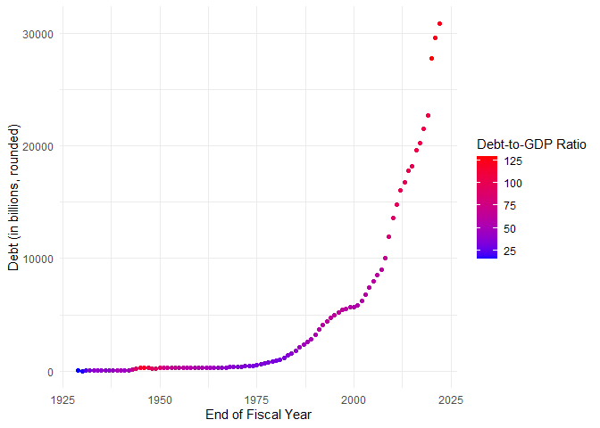

United States Debt
================
Benjamin Panny
2024-04-09

``` r
# install.packages(c("rvest", "dplyr"))
library(rvest)
library(tidyverse)
```

    ## ── Attaching core tidyverse packages ──────────────────────── tidyverse 2.0.0 ──
    ## ✔ dplyr     1.1.2     ✔ readr     2.1.4
    ## ✔ forcats   1.0.0     ✔ stringr   1.5.0
    ## ✔ ggplot2   3.4.2     ✔ tibble    3.2.1
    ## ✔ lubridate 1.9.2     ✔ tidyr     1.3.0
    ## ✔ purrr     1.0.1     
    ## ── Conflicts ────────────────────────────────────────── tidyverse_conflicts() ──
    ## ✖ dplyr::filter()         masks stats::filter()
    ## ✖ readr::guess_encoding() masks rvest::guess_encoding()
    ## ✖ dplyr::lag()            masks stats::lag()
    ## ℹ Use the conflicted package (<http://conflicted.r-lib.org/>) to force all conflicts to become errors

``` r
url <- "https://www.thebalancemoney.com/national-debt-by-year-compared-to-gdp-and-major-events-3306287"
webpage <- read_html(url)
tables <- html_table(webpage)
my_table <- tables[[1]] # Adjust the index [[1]] based on which table you need
debt <- my_table %>%
  mutate(`Debt (in billions, rounded)` = as.integer(str_replace_all(`Debt (in billions, rounded)`, c("\\$" = "", "," = ""))),
         `Debt-to-GDP Ratio` = as.integer(str_replace_all(`Debt-to-GDP Ratio`, "%", "")))
```

``` r
debt %>%
  ggplot(aes(x = `End of Fiscal Year`, y = `Debt (in billions, rounded)`, color = `Debt-to-GDP Ratio`)) +
  geom_point() +
  scale_color_gradient(low = "blue", high = "red") +
  theme_minimal()
```

<!-- -->
